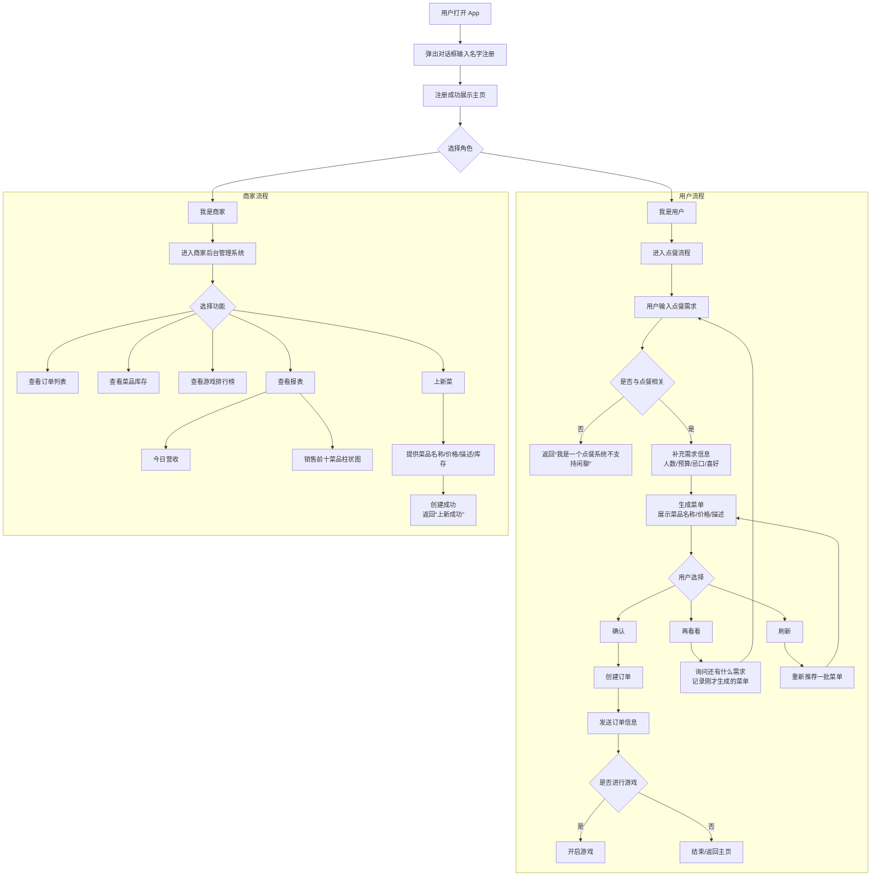

## 流程图

## 这是系统的全部流程

1. 用户打开app，首先弹出对话框输入名字进行注册
2. 注册成功展示主页，选择我是用户还是我是商家

### 我是用户

1. 点击我是用户后
2. 点餐流程
    1. 需要用户提供点餐的需求
    2. 如果跟点餐相关，需要用户提供点餐的需求，比如多少人预算多少，忌口，喜好
    3. 用户发送需求以后，根据描述生成菜单，展示菜品名称，价格，描述
    4. 如果用户点击确认，创建订单
    5. 如果用户点击再看看，则询问用户还有什么需求，然后返回第一步重新开始，并记录刚才生成的菜单
    6. 用户还可以点击刷新，会重新推荐一批
    7. 创建订单成功以后给用户发送订单信息
    8. 在确认订单以后可以提示是否进行游戏
    9. 点击确认以后开启游戏
3. 如果输入跟点餐无关的，返回 “我是一个点餐系统不支持闲聊”

### 我是商家

1. 点击我是商家后
2. 进入商家后台管理系统，提供以下功能
    1. 查看订单列表
    2. 查看菜品库存
    3. 查看游戏排行榜
    4. 查看报表
        - 今日营收
        - 销售前十的菜品柱状图
    5. 上新菜
        1. 提供菜品名称，价格，描述，库存
        2. 创建成功以后返回“上新成功”
