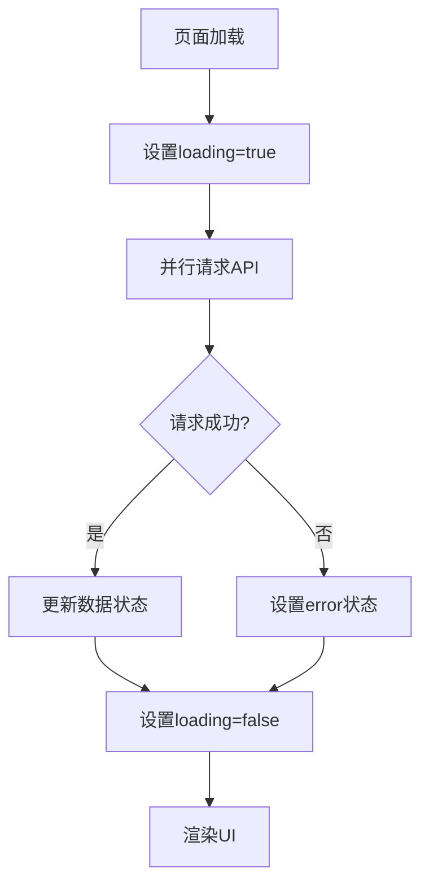

# 数据报表界面实现文档

## 系统概述

本文档描述了ChatUI前端项目中数据报表界面的实现细节，包括架构设计、功能特性、技术实现和使用指南。

---

## 功能特性

### 1. 今日营收展示
- 显示今日已完成订单的总收入
- 显示今日订单数量统计
- 显示查询日期
- 金额格式化显示（¥符号、2位小数）
- 蓝色醒目大字体展示

### 2. 菜品销量排行榜
- 显示销量Top 10的菜品
- 按销量降序排列
- 可视化柱状图展示
- 前3名特殊颜色标识（红、橙、黄）
- 显示每个菜品的：
  - 排名序号
  - 菜品名称
  - 总销量（份数）
  - 总收入金额
  - 出现在多少个订单中

### 3. 加载状态
- 加载动画（SpinLoading）
- 加载提示文字
- 流畅的加载体验

### 4. 错误处理
- API请求失败时显示错误提示
- 友好的错误信息展示
- Toast提示

### 5. 空数据处理
- 没有数据时显示Empty组件
- 友好的空状态提示

---

## 技术架构

### 技术栈
- **框架**: React 18.2
- **UI组件库**: antd-mobile 5.34
- **路由**: react-router-dom 6.8
- **HTTP请求**: Fetch API
- **状态管理**: React Hooks (useState, useEffect)

### 项目结构
```
ChatUI/src/
├── api/
│   └── orderApi.js              # 订单API（包含报表API）
├── pages/
│   └── MerchantDashboard/
│       └── DataReports.js       # 数据报表页面
└── config/
    └── index.js                 # 环境配置
```

---

## API接口定义

### 1. 查询今日总收入
**接口**: `GET /api/ordering/reports/today-revenue`

**请求参数**:
- `date` (可选): 查询日期（YYYY-MM-DD格式）

**响应格式**:
```json
{
  "code": 0,
  "message": "查询成功",
  "data": {
    "date": "2026-01-29",
    "totalRevenue": 1580.50,
    "orderCount": 15
  }
}
```

### 2. 查询菜品排行榜
**接口**: `GET /api/ordering/reports/dish-ranking`

**请求参数**:
- `limit` (可选): 返回数量，默认10，最大50

**响应格式**:
```json
{
  "code": 0,
  "message": "查询成功",
  "data": [
    {
      "dishId": "507f1f77bcf86cd799439011",
      "dishName": "宫保鸡丁",
      "totalQuantity": 128,
      "totalRevenue": 3584.00,
      "orderCount": 98
    }
  ]
}
```

---

## 代码实现

### API层实现 (orderApi.js)

```javascript
// 查询今日总收入
getTodayRevenue: async (date) => {
  try {
    const url = date 
      ? `${API_BASE_URL}/ordering/reports/today-revenue?date=${date}`
      : `${API_BASE_URL}/ordering/reports/today-revenue`;
    
    const response = await fetch(url, {
      method: 'GET',
      headers: getHeaders(),
    });
    const data = await response.json();
    if (!response.ok) throw new Error(data.message || '获取今日收入失败');
    return data;
  } catch (error) {
    console.error('Get today revenue error:', error);
    throw error;
  }
},

// 查询菜品排行榜
getDishRanking: async (limit = 10) => {
  try {
    const response = await fetch(
      `${API_BASE_URL}/ordering/reports/dish-ranking?limit=${limit}`,
      {
        method: 'GET',
        headers: getHeaders(),
      }
    );
    const data = await response.json();
    if (!response.ok) throw new Error(data.message || '获取菜品排行失败');
    return data;
  } catch (error) {
    console.error('Get dish ranking error:', error);
    throw error;
  }
}
```

### 组件实现 (DataReports.js)

#### 状态管理
```javascript
const [loading, setLoading] = useState(true);
const [error, setError] = useState(null);
const [revenueData, setRevenueData] = useState(null);
const [dishRanking, setDishRanking] = useState([]);
```

#### 数据加载
```javascript
const loadReportData = async () => {
  try {
    setLoading(true);
    setError(null);

    // 并行请求今日收入和菜品排行
    const [revenueResponse, rankingResponse] = await Promise.all([
      orderApi.getTodayRevenue(),
      orderApi.getDishRanking(10)
    ]);

    if (revenueResponse.code === 0) {
      setRevenueData(revenueResponse.data);
    }

    if (rankingResponse.code === 0) {
      setDishRanking(rankingResponse.data);
    }
  } catch (err) {
    console.error('加载报表数据失败:', err);
    setError(err.message || '加载数据失败，请稍后重试');
    Toast.show({
      icon: 'fail',
      content: '加载数据失败'
    });
  } finally {
    setLoading(false);
  }
};
```

#### 金额格式化
```javascript
const formatCurrency = (amount) => {
  return `¥${amount.toFixed(2)}`;
};
```

---

## UI设计

### 1. 今日营收卡片

**布局**:
```
┌─────────────────────────────┐
│ 今日营收    2026-01-29      │
├─────────────────────────────┤
│                             │
│      ¥1,580.50              │ ← 大号蓝色字体
│                             │
│   订单数量：15 单            │ ← 灰色小字
│                             │
└─────────────────────────────┘
```

**样式特点**:
- 卡片间距：16px
- 金额字体：36px，粗体，蓝色(#1677ff)
- 订单数量：14px，灰色(#999)
- 内边距：16px

### 2. 菜品排行榜卡片

**布局**:
```
┌───────────────────────────────────────┐
│ 菜品销量排行榜 TOP 10                  │
├───────────────────────────────────────┤
│ ① 宫保鸡丁                 ¥3,584.00  │
│ ████████████████████████  128份       │
│ 出现在 98 个订单中                     │
├───────────────────────────────────────┤
│ ② 鱼香肉丝                 ¥3,220.00  │
│ ████████████████████      115份       │
│ 出现在 87 个订单中                     │
├───────────────────────────────────────┤
│ ...                                   │
└───────────────────────────────────────┘
```

**样式特点**:
- 排名圆形徽章：
  - 第1名：红色(#ff4d4f)
  - 第2名：橙色(#ff7a45)
  - 第3名：黄色(#ffa940)
  - 其他：灰色(#d9d9d9)
- 柱状图：
  - 填充色：蓝色(#1677ff)
  - 背景色：浅灰(#f5f5f5)
  - 高度：24px
  - 圆角：4px
  - 动画：0.3s ease过渡
- 分隔线：1px #f0f0f0

---

## 状态管理

### 加载流程



### 状态机

| 状态 | loading | error | data | 显示内容 |
|-----|---------|-------|------|---------|
| 初始化 | true | null | null | 加载动画 |
| 加载成功 | false | null | data | 数据展示 |
| 加载失败 | false | error | null | 错误提示 |
| 空数据 | false | null | [] | 空状态 |

---

## 路由配置

### 路由路径
- **页面URL**: `/merchant/reports`
- **父路由**: `/merchant` (商家后台)

### 路由代码
```javascript
<Route path="/merchant/reports" element={<DataReports />} />
```

### 导航入口
- 商家后台首页 → "数据报表"卡片
- 返回按钮 → 商家后台首页

---

## 错误处理

### 1. 网络错误
```javascript
catch (error) {
  console.error('加载报表数据失败:', error);
  setError(error.message || '加载数据失败，请稍后重试');
  Toast.show({
    icon: 'fail',
    content: '加载数据失败'
  });
}
```

### 2. 空数据处理
```javascript
{dishRanking.length === 0 ? (
  <Empty
    description="暂无数据"
    style={{ padding: '32px 0' }}
  />
) : (
  // 显示数据
)}
```

### 3. API响应错误
```javascript
if (!response.ok) {
  throw new Error(data.message || '获取数据失败');
}
```

---

## 性能优化

### 1. 并行请求
使用 `Promise.all` 并行请求多个API，减少总等待时间：
```javascript
const [revenueResponse, rankingResponse] = await Promise.all([
  orderApi.getTodayRevenue(),
  orderApi.getDishRanking(10)
]);
```

### 2. 组件优化
- 使用 `useState` 管理本地状态
- 使用 `useEffect` 在组件挂载时加载数据
- 避免不必要的重渲染

### 3. 数据缓存
- 考虑添加数据缓存机制
- 实现下拉刷新功能

---

## 响应式设计

### 移动端适配
- 使用antd-mobile组件库，天然支持移动端
- 卡片宽度100%自适应
- 字体大小合理，触摸区域足够大

### 屏幕适配
- 支持各种屏幕尺寸
- 使用相对单位（px、%）
- 保持内容可读性

---

## 使用指南

### 用户操作流程
1. 登录系统
2. 选择"商家后台"角色
3. 点击"数据报表"卡片
4. 查看今日营收和菜品排行
5. 点击返回按钮返回首页

### 数据刷新
- 进入页面自动加载最新数据
- 手动刷新页面重新获取数据
- 建议定期刷新查看最新统计

---

## 测试说明

### 单元测试
- 测试API调用正确性
- 测试数据格式化函数
- 测试错误处理逻辑

### 集成测试
- 测试完整的数据加载流程
- 测试路由跳转
- 测试用户交互

### UI测试
- 测试加载状态显示
- 测试数据展示正确性
- 测试错误状态显示
- 测试空数据状态
- 测试响应式布局

详细测试用例请参考: [reports-ui.testcase.md](../../Documents/frontend/reports-ui.testcase.md)

---

## 部署说明

### 环境变量
```bash
# .env (开发环境)
REACT_APP_API_URL=http://localhost:3001/api

# .env.production (生产环境)
REACT_APP_API_URL=/api
```

### 构建命令
```bash
npm run build
```

### 部署文件
- 构建产物位于 `dist/` 目录
- 需要配置Nginx代理API请求

---

## 故障排查

### 问题1: 数据不显示
**可能原因**:
- 后端服务未启动
- API地址配置错误
- 数据库中没有completed订单

**解决方案**:
1. 检查后端服务状态
2. 验证环境变量配置
3. 查看浏览器控制台错误
4. 检查Network面板的API请求

### 问题2: 显示"加载失败"
**可能原因**:
- 网络连接问题
- API响应格式错误
- 认证token无效

**解决方案**:
1. 检查网络连接
2. 查看API响应数据
3. 验证认证状态

### 问题3: 样式显示异常
**可能原因**:
- CSS文件未正确加载
- antd-mobile版本不兼容

**解决方案**:
1. 清除浏览器缓存
2. 重新构建项目
3. 检查依赖版本

---

## 未来改进

### 功能扩展
1. **日期范围选择**
   - 添加日期选择器
   - 支持查询任意日期的收入

2. **导出功能**
   - 导出Excel报表
   - 导出PDF报告

3. **实时更新**
   - WebSocket实时数据推送
   - 自动刷新功能

4. **数据可视化增强**
   - 添加折线图、饼图
   - 添加趋势分析
   - 添加同比环比数据

5. **筛选功能**
   - 按分类筛选菜品
   - 按金额范围筛选
   - 按时间段筛选

### 性能优化
1. 添加数据缓存
2. 实现虚拟滚动（大数据量时）
3. 优化图表渲染性能

### 用户体验
1. 添加下拉刷新
2. 添加骨架屏
3. 添加数据加载进度条
4. 优化动画效果

---

## 相关文档

- **前端项目说明**: [fontend-instructions.md](../../.github/fontend-instructions.md)
- **前端开发规范**: [SKILL.md](../../.github/skills/fontend/SKILL.md)
- **后端API文档**: [backend-instructions.md](../../.github/backend-instructions.md)
- **测试用例**: [reports-ui.testcase.md](../../Documents/frontend/reports-ui.testcase.md)

---

## 更新日志

### v1.0.0 (2026-01-29)
- ✅ 实现今日营收展示功能
- ✅ 实现菜品排行榜展示功能
- ✅ 集成后端报表API
- ✅ 添加加载状态和错误处理
- ✅ 优化UI样式和交互体验

---

## 贡献者

- 开发者: AI Assistant
- 测试者: 待定
- 审核者: 待定
