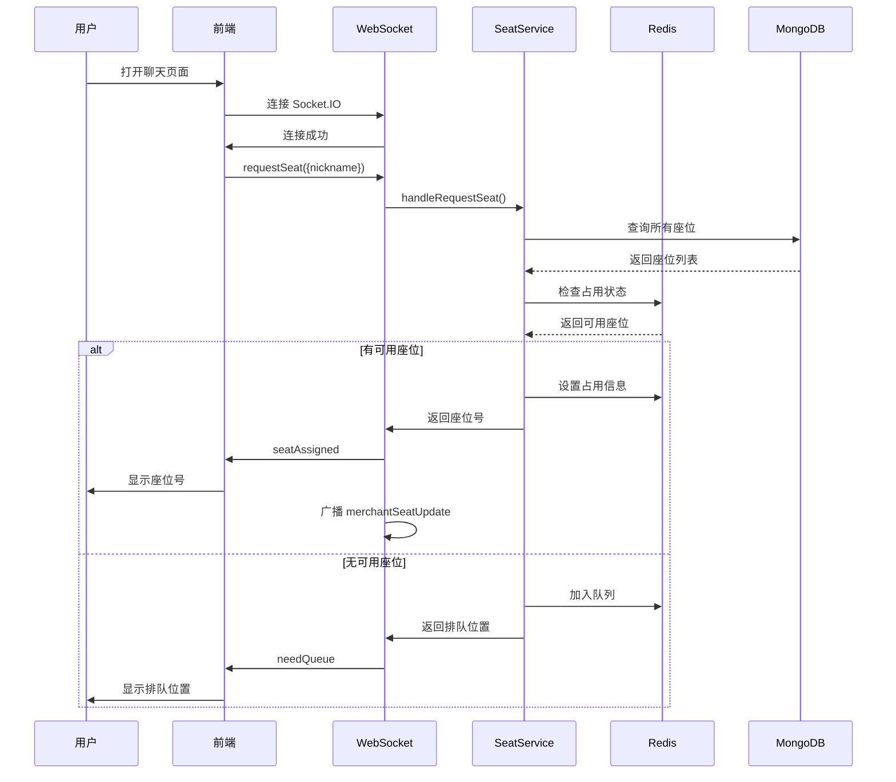
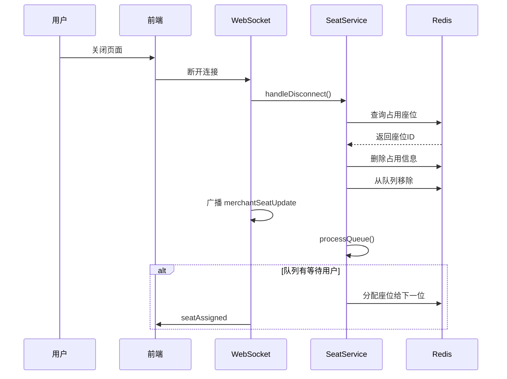

# 座位管理系统完整说明文档

## 📋 目录

1. [系统概述](#系统概述)
2. [架构设计](#架构设计)
3. [功能特性](#功能特性)
4. [技术实现](#技术实现)
5. [API 接口文档](#api-接口文档)
6. [WebSocket 事件](#websocket-事件)
7. [数据模型](#数据模型)
8. [使用指南](#使用指南)
9. [部署运行](#部署运行)
10. [测试说明](#测试说明)
11. [故障排查](#故障排查)

---

## 系统概述

### 项目简介

座位管理系统是 Ai-Chat-Demo 项目的核心模块之一，实现了智能化的餐厅座位分配、排队管理和实时状态监控功能。系统采用 **Redis + MongoDB 混合架构**，结合 **WebSocket 实时通信**，为商家和用户提供高效、流畅的座位管理体验。

### 核心功能

- ✅ **自动座位分配**：用户进入聊天时自动分配座位
- ✅ **智能排队系统**：座位满时自动加入 FIFO 队列
- ✅ **实时状态同步**：商家端实时查看座位占用情况
- ✅ **用户信息管理**：记录用户昵称、进入时间等信息
- ✅ **座位 CRUD 操作**：商家可创建、更新、删除座位
- ✅ **自动释放机制**：用户断线时自动释放座位
- ✅ **高性能存储**：使用 Redis 存储实时状态，响应速度快

### 适用场景

- 餐厅在线预约与排队
- 咖啡厅座位管理
- 图书馆座位预定
- 共享办公空间管理
- 任何需要座位分配的场景

---

## 架构设计

### 整体架构

```
┌──────────────┐         WebSocket         ┌──────────────┐
│              │◄─────────────────────────►│              │
│   前端 UI    │                            │   后端服务    │
│  (React)     │         REST API           │   (NestJS)   │
│              │◄─────────────────────────►│              │
└──────────────┘                            └──────┬───────┘
                                                   │
                                    ┌──────────────┼──────────────┐
                                    │              │              │
                                    ▼              ▼              ▼
                              ┌─────────┐    ┌─────────┐    ┌─────────┐
                              │  Redis  │    │ MongoDB │    │ Socket  │
                              │ (实时)  │    │ (持久)  │    │   IO    │
                              └─────────┘    └─────────┘    └─────────┘
```

### 数据存储策略

#### MongoDB 存储（持久化层）

MongoDB 仅用于存储**静态配置信息**：

| 字段 | 类型 | 说明 | 是否必需 |
|------|------|------|---------|
| `_id` | ObjectId | 座位唯一标识 | ✅ |
| `seatNumber` | Number | 座位号（唯一） | ✅ |
| `isActive` | Boolean | 软删除标志 | ✅ |
| `createdAt` | Date | 创建时间 | ✅ |
| `updatedAt` | Date | 更新时间 | ✅ |
| `status` | String | ⚠️ 已废弃（仅作后备） | ❌ |
| `occupiedBy` | String | ⚠️ 已废弃（仅作后备） | ❌ |
| `occupiedByName` | String | ⚠️ 已废弃（仅作后备） | ❌ |
| `occupiedAt` | Date | ⚠️ 已废弃（仅作后备） | ❌ |

#### Redis 存储（实时状态层）

Redis 用于存储**所有实时状态和临时数据**：

##### 1. 座位占用信息（合并状态+详情）
- **Key 格式**: `seat:status:occupied:{seatId}`
- **数据类型**: String (JSON)
- **存在性**: 键存在 = 已占用，键不存在 = 可用
- **Value 结构**:
  ```json
  {
    "socketId": "abc123",
    "nickname": "张三",
    "occupiedAt": "2026-01-27T10:30:00.000Z"
  }
  ```

##### 2. 排队列表
- **Key 格式**: `seat:queue`
- **数据类型**: List (FIFO)
- **存储内容**: socketId 列表，按加入顺序排列

##### 3. 排队详细信息
- **Key 格式**: `seat:queue:info:{socketId}`
- **数据类型**: String (JSON)
- **Value 结构**:
  ```json
  {
    "socketId": "abc123",
    "nickname": "李四",
    "queuedAt": "2026-01-27T10:35:00.000Z",
    "partySize": 4
  }
  ```

### 架构优势

| 优势 | 说明 |
|------|------|
| **高性能** | Redis 内存存储，读写速度提升 10-100 倍 |
| **数据一致性** | 单一真实数据源（Redis），避免状态不同步 |
| **可扩展性** | Redis 支持集群和主从复制 |
| **故障恢复** | MongoDB 保留基本信息，Redis 宕机可重建 |
| **实时性** | WebSocket 毫秒级推送，商家端实时更新 |

---

## 功能特性

### 1. 用户端功能

#### 自动座位分配
- 用户进入聊天页面时自动连接 WebSocket
- 系统检查是否有可用座位
- 有空位：随机分配一个座位，返回座位号
- 无空位：加入排队队列，返回排队位置

#### 自动释放座位
- 用户关闭页面时自动断开连接
- 系统自动释放该用户占用的座位
- 座位释放后自动通知商家端
- 如有排队用户，自动为下一位分配座位

#### 排队通知
- 显示当前排队位置
- 实时更新排队状态
- 轮到时收到叫号通知

### 2. 商家端功能

#### 实时监控
- 实时查看所有座位状态（空闲/用餐中/已关闭）
- 查看每个座位的占用用户信息
- 显示用户昵称和进入时间
- 实时显示排队人数

#### 座位管理
- **创建座位**：输入座位号创建新座位
- **开启/关闭座位**：临时关闭座位（如维修）
- **删除座位**：永久删除座位（软删除）
- **查看统计**：总座位数、空闲数、用餐中数、排队数

#### 统计面板
```
┌─────────┬─────────┬─────────┬─────────┐
│ 总座位  │  空闲   │ 用餐中  │ 排队中  │
│   10    │    5    │    3    │    2    │
└─────────┴─────────┴─────────┴─────────┘
```

### 3. 系统自动化功能

#### 智能分配算法
- 随机分配算法：从可用座位中随机选择
- 支持扩展：未来可实现优先级分配、区域分配等

#### 排队管理
- FIFO（先进先出）队列
- 自动叫号机制
- 座位释放时自动处理队列

#### 状态同步
- 座位状态变化实时广播
- 商家端自动刷新
- 用户端自动更新排队位置

---

## 技术实现

### 后端技术栈

| 技术 | 版本 | 用途 |
|------|------|------|
| NestJS | 11.0.1 | 后端框架 |
| MongoDB | 9.1.5 | 持久化数据库 |
| Mongoose | - | MongoDB ODM |
| Redis | 7-alpine | 实时状态存储 |
| Socket.IO | 4.8.3 | 实时通信 |
| class-validator | - | 数据验证 |
| Swagger | - | API 文档 |

### 前端技术栈

| 技术 | 版本 | 用途 |
|------|------|------|
| React | 18.2 | 前端框架 |
| antd-mobile | 5.34 | UI 组件库 |
| react-router-dom | - | 路由管理 |
| socket.io-client | 4.8.3 | WebSocket 客户端 |

### 项目结构

#### 后端文件结构
```
ChatBackEnd/src/modules/seat/
├── schemas/
│   └── seat.schema.ts              # 座位数据模型（MongoDB Schema）
├── dto/
│   ├── create-seat.dto.ts          # 创建座位 DTO
│   ├── update-seat.dto.ts          # 更新座位 DTO
│   └── join-queue.dto.ts           # 加入排队 DTO
├── seat.controller.ts              # REST API 控制器
├── seat.service.ts                 # 业务逻辑层（核心）
├── seat.gateway.ts                 # Socket.IO 网关（WebSocket）
└── seat.module.ts                  # 模块定义

ChatBackEnd/src/redis/
├── redis.service.ts                # Redis 原生客户端服务
└── redis.module.ts                 # Redis 模块定义
```

#### 前端文件结构
```
ChatUI/src/pages/
├── MerchantDashboard/
│   ├── SeatManagement.js           # 商家座位管理页面
│   ├── MerchantDashboard.js        # 商家后台主页
│   └── MerchantDashboard.css       # 样式文件
├── Chat/
│   └── Chat.js                     # 普通聊天页面（集成座位请求）
└── UserOrder/
    └── UserOrder.js                # 点餐聊天页面（集成座位请求）
```

### 核心代码解析

#### 1. 座位分配逻辑 (seat.gateway.ts)

```typescript
@SubscribeMessage('requestSeat')
async handleRequestSeat(
  @ConnectedSocket() client: Socket,
  @MessageBody() data: { nickname?: string },
) {
  // 1. 检查可用座位
  const availableSeats = await this.seatService.findAvailableSeats();

  if (availableSeats.length > 0) {
    // 2. 随机分配座位
    const randomIndex = Math.floor(Math.random() * availableSeats.length);
    const seat = availableSeats[randomIndex];

    // 3. 占用座位（写入 Redis）
    const occupiedSeat = await this.seatService.occupySeat(
      seat._id.toString(),
      client.id,
      data?.nickname,
    );

    // 4. 通知用户
    client.emit('seatAssigned', {
      seatNumber: occupiedSeat.seatNumber,
      seatId: occupiedSeat._id.toString(),
    });

    // 5. 广播给商家端
    await this.notifyMerchantSeatChange();
  } else {
    // 6. 加入排队队列
    const position = await this.seatService.joinQueue(
      client.id,
      data?.nickname,
      1,
    );

    // 7. 通知用户排队位置
    client.emit('needQueue', {
      position,
      queueLength: await this.seatService.getQueueLength(),
    });
  }
}
```

#### 2. 自动释放座位 (seat.gateway.ts)

```typescript
async handleDisconnect(@ConnectedSocket() client: Socket) {
  // 1. 释放座位（从 Redis 删除占用信息）
  const releasedSeat = await this.seatService.releaseSeatBySocketId(client.id);

  // 2. 从排队列表移除
  await this.seatService.leaveQueue(client.id);

  // 3. 通知商家端
  if (releasedSeat) {
    await this.notifyMerchantSeatChange();
    
    // 4. 自动处理队列中等待的用户
    await this.processQueue();
  }
}
```

#### 3. 占用座位逻辑 (seat.service.ts)

```typescript
async occupySeat(id: string, socketId: string, nickname?: string): Promise<Seat> {
  // 1. 查询座位基本信息（MongoDB）
  const seat = await this.seatModel.findById(id).exec();
  
  if (!seat || !seat.isActive) {
    throw new NotFoundException(`座位 ID ${id} 未找到`);
  }
  
  // 2. 检查 Redis 中是否已被占用
  const existingInfo = await this.redisService.get(
    `${SEAT_STATUS_OCCUPIED_PREFIX}${id}`
  );
  
  if (existingInfo) {
    throw new ConflictException('座位不可用');
  }

  // 3. 在 Redis 中设置占用信息
  const occupiedInfo: SeatOccupiedInfo = {
    socketId,
    nickname,
    occupiedAt: new Date().toISOString(),
  };
  
  await this.redisService.set(
    `${SEAT_STATUS_OCCUPIED_PREFIX}${id}`,
    JSON.stringify(occupiedInfo)
  );
  
  return seat;
}
```

#### 4. 获取可用座位 (seat.service.ts)

```typescript
async findAvailableSeats(): Promise<Seat[]> {
  // 1. 从 MongoDB 获取所有活跃座位
  const allSeats = await this.findAll();
  const availableSeats = [];

  // 2. 遍历检查 Redis 中的占用状态
  for (const seat of allSeats) {
    const occupiedInfo = await this.redisService.get(
      `${SEAT_STATUS_OCCUPIED_PREFIX}${seat._id}`
    );
    
    // 3. 没有占用信息 = 可用座位
    if (!occupiedInfo) {
      availableSeats.push(seat);
    }
  }

  return availableSeats;
}
```

#### 5. 排队系统 (seat.service.ts)

```typescript
// 加入排队
async joinQueue(socketId: string, nickname?: string, partySize: number = 1) {
  // 1. 添加到 Redis List（FIFO 队列）
  await this.redisService.rpush(QUEUE_KEY, socketId);
  
  // 2. 存储排队详细信息
  const queueInfo = {
    socketId,
    nickname,
    queuedAt: new Date().toISOString(),
    partySize,
  };
  
  await this.redisService.set(
    `${QUEUE_INFO_PREFIX}${socketId}`,
    JSON.stringify(queueInfo)
  );
  
  // 3. 返回排队位置
  return await this.getQueuePosition(socketId);
}

// 叫号（分配座位给下一位）
async callNext(): Promise<QueueInfo | null> {
  // 1. 从队列头部取出一个 socketId
  const socketId = await this.redisService.lpop(QUEUE_KEY);
  
  if (!socketId) {
    return null;
  }
  
  // 2. 获取排队信息
  const infoStr = await this.redisService.get(
    `${QUEUE_INFO_PREFIX}${socketId}`
  );
  
  if (infoStr) {
    await this.redisService.del(`${QUEUE_INFO_PREFIX}${socketId}`);
    return JSON.parse(infoStr);
  }
  
  return null;
}
```

---

## API 接口文档

### 基础信息

- **Base URL**: `http://localhost:3001/api`
- **认证方式**: 无（当前版本）
- **数据格式**: JSON

### 座位管理接口

#### 1. 创建座位

```http
POST /seats
Content-Type: application/json

{
  "seatNumber": 1,
  "status": "available"  // 可选，默认 available
}
```

**响应示例**:
```json
{
  "_id": "507f1f77bcf86cd799439011",
  "seatNumber": 1,
  "status": "available",
  "isActive": true,
  "createdAt": "2026-01-27T10:00:00.000Z",
  "updatedAt": "2026-01-27T10:00:00.000Z"
}
```

#### 2. 获取所有座位（不含实时状态）

```http
GET /seats
```

**响应示例**:
```json
[
  {
    "_id": "507f1f77bcf86cd799439011",
    "seatNumber": 1,
    "isActive": true,
    "createdAt": "2026-01-27T10:00:00.000Z"
  }
]
```

#### 3. 获取所有座位及实时状态（从 Redis）

```http
GET /seats/with-status
```

**响应示例**:
```json
[
  {
    "_id": "507f1f77bcf86cd799439011",
    "seatNumber": 1,
    "status": "occupied",
    "realTimeStatus": "occupied",
    "occupiedByName": "张三",
    "occupiedAt": "2026-01-27T10:30:00.000Z",
    "occupiedBy": "abc123",
    "occupiedInfo": {
      "socketId": "abc123",
      "nickname": "张三",
      "occupiedAt": "2026-01-27T10:30:00.000Z"
    }
  },
  {
    "_id": "507f1f77bcf86cd799439012",
    "seatNumber": 2,
    "status": "available",
    "realTimeStatus": "available",
    "occupiedInfo": null,
    "occupiedByName": undefined
  }
]
```

#### 4. 获取可用座位（从 Redis）

```http
GET /seats/available
```

**响应示例**:
```json
[
  {
    "_id": "507f1f77bcf86cd799439012",
    "seatNumber": 2,
    "isActive": true
  }
]
```

#### 5. 获取座位统计信息

```http
GET /seats/statistics
```

**响应示例**:
```json
{
  "total": 10,
  "available": 5,
  "occupied": 3,
  "closed": 2,
  "queueLength": 4
}
```

#### 6. 获取指定座位

```http
GET /seats/:id
```

#### 7. 获取座位实时状态（从 Redis）

```http
GET /seats/:id/status
```

**响应示例**:
```json
{
  "status": "occupied",
  "occupiedInfo": {
    "socketId": "abc123",
    "nickname": "张三",
    "occupiedAt": "2026-01-27T10:30:00.000Z"
  }
}
```

#### 8. 更新座位信息

```http
PATCH /seats/:id
Content-Type: application/json

{
  "seatNumber": 1,
  "status": "closed"
}
```

#### 9. 删除座位（软删除）

```http
DELETE /seats/:id
```

### 排队系统接口

#### 10. 加入排队

```http
POST /seats/queue/join
Content-Type: application/json

{
  "socketId": "abc123",
  "nickname": "李四",
  "partySize": 4
}
```

**响应示例**:
```json
{
  "position": 3,
  "message": "您当前排在第 3 位"
}
```

#### 11. 离开排队

```http
DELETE /seats/queue/leave?socketId=abc123
```

#### 12. 获取排队列表

```http
GET /seats/queue/list
```

**响应示例**:
```json
[
  {
    "socketId": "abc123",
    "nickname": "李四",
    "queuedAt": "2026-01-27T10:35:00.000Z",
    "partySize": 4
  }
]
```

#### 13. 查询排队位置

```http
GET /seats/queue/position?socketId=abc123
```

**响应示例**:
```json
{
  "position": 2,
  "message": "您当前排在第 2 位"
}
```

#### 14. 叫号（商家操作）

```http
POST /seats/queue/call-next
```

**响应示例**:
```json
{
  "socketId": "abc123",
  "nickname": "李四",
  "queuedAt": "2026-01-27T10:35:00.000Z",
  "partySize": 4
}
```

---

## WebSocket 事件

### 连接配置

```javascript
const socket = io('http://localhost:3001/seat', {
  transports: ['websocket'],
});
```

### 客户端 → 服务器事件

| 事件名 | 参数 | 说明 | 使用场景 |
|--------|------|------|----------|
| `requestSeat` | `{ nickname?: string }` | 请求分配座位 | 用户进入聊天 |
| `leaveSeat` | 无 | 主动离开座位 | 用户点击离开按钮 |
| `getMerchantSeatStatus` | 无 | 请求座位状态 | 商家端初始化 |
| `getQueueStatus` | 无 | 查询排队状态 | 用户查询排队 |

### 服务器 → 客户端事件

| 事件名 | 数据结构 | 说明 | 接收者 |
|--------|----------|------|--------|
| `seatAssigned` | `{ seatNumber, seatId }` | 座位已分配 | 单个用户 |
| `needQueue` | `{ position, queueLength }` | 需要排队 | 单个用户 |
| `queueUpdate` | `{ position, queueLength }` | 排队位置更新 | 单个用户 |
| `called` | `{ message }` | 叫号通知 | 单个用户 |
| `seatReleased` | `{ message }` | 座位已释放 | 单个用户 |
| `merchantSeatStatus` | 座位详细信息 | 初始座位状态 | 单个商家 |
| `merchantSeatUpdate` | 座位详细信息 | 座位状态更新 | 所有商家 |
| `seatStatus` | `{ total, available, occupied, closed }` | 统计信息 | 所有客户端 |
| `queueStatus` | `{ queueLength }` | 队列信息 | 所有客户端 |
| `error` | `{ message }` | 错误信息 | 单个客户端 |

### 事件数据结构详解

#### merchantSeatUpdate / merchantSeatStatus

```json
{
  "seats": [
    {
      "_id": "507f1f77bcf86cd799439011",
      "seatNumber": 1,
      "realTimeStatus": "occupied",
      "occupiedInfo": {
        "socketId": "abc123",
        "nickname": "张三",
        "occupiedAt": "2026-01-27T10:30:00.000Z"
      }
    }
  ],
  "statistics": {
    "total": 10,
    "available": 5,
    "occupied": 3,
    "closed": 2,
    "queueLength": 2
  },
  "queueList": [
    {
      "socketId": "def456",
      "nickname": "李四",
      "queuedAt": "2026-01-27T10:35:00.000Z",
      "partySize": 4
    }
  ],
  "timestamp": "2026-01-27T10:40:00.000Z"
}
```

---

## 数据模型

### MongoDB Schema (seat.schema.ts)

```typescript
export enum SeatStatus {
  AVAILABLE = 'available',     // 可用
  OCCUPIED = 'occupied',        // 已占用（用餐中）
  CLOSED = 'closed',            // 已关闭（临时不可用）
}

@Schema({ timestamps: true })
export class Seat {
  _id: string;

  @Prop({ required: true, unique: true })
  seatNumber: number;

  @Prop({ 
    type: String, 
    enum: SeatStatus, 
    default: SeatStatus.AVAILABLE 
  })
  status: SeatStatus;  // ⚠️ 已废弃

  @Prop()
  occupiedBy?: string;  // ⚠️ 已废弃

  @Prop()
  occupiedByName?: string;  // ⚠️ 已废弃

  @Prop()
  occupiedAt?: Date;  // ⚠️ 已废弃

  @Prop({ default: true })
  isActive: boolean;  // 软删除标志
}
```

### DTO (Data Transfer Objects)

#### CreateSeatDto
```typescript
export class CreateSeatDto {
  @IsNumber()
  @Min(1)
  seatNumber: number;

  @IsEnum(SeatStatus)
  @IsOptional()
  status?: SeatStatus;
}
```

#### UpdateSeatDto
```typescript
export class UpdateSeatDto extends PartialType(CreateSeatDto) {
  @IsEnum(SeatStatus)
  @IsOptional()
  status?: SeatStatus;
}
```

#### JoinQueueDto
```typescript
export class JoinQueueDto {
  @IsString()
  socketId: string;

  @IsOptional()
  @IsString()
  nickname?: string;

  @IsNumber()
  @Min(1)
  partySize: number = 1;
}
```

### Redis 数据结构

#### 座位占用信息
```typescript
export interface SeatOccupiedInfo {
  socketId: string;        // 用户 Socket ID
  nickname?: string;       // 用户昵称
  occupiedAt: string;      // 占用时间（ISO 8601）
}
```

#### 排队信息
```typescript
export interface QueueInfo {
  socketId: string;        // 用户 Socket ID
  nickname?: string;       // 用户昵称
  queuedAt: string;        // 排队时间（ISO 8601）
  partySize: number;       // 用餐人数
}
```

---

## 使用指南

### 用户端使用流程

#### 1. 进入聊天页面

```javascript
// Chat.js 或 UserOrder.js
useEffect(() => {
  // 初始化 Socket.IO 连接
  socket = io('http://localhost:3001/seat', {
    transports: ['websocket'],
  });

  socket.on('connect', () => {
    // 获取用户信息
    const userInfo = JSON.parse(localStorage.getItem('userInfo') || '{}');
    
    // 请求座位
    socket.emit('requestSeat', { 
      nickname: userInfo.nickname 
    });
  });

  // 监听座位分配
  socket.on('seatAssigned', (data) => {
    Toast.show({
      icon: 'success',
      content: `已分配座位：${data.seatNumber}号`,
    });
  });

  // 监听排队通知
  socket.on('needQueue', (data) => {
    Toast.show({
      icon: 'info',
      content: `当前座位已满，您在队列中的位置：${data.position}`,
    });
  });

  return () => {
    if (socket) {
      socket.disconnect(); // 自动释放座位
    }
  };
}, []);
```

#### 2. 用户使用场景

**场景 A：有可用座位**
```
1. 用户注册并输入昵称 "张三"
2. 选择角色进入聊天页面
3. 系统自动分配座位 5 号
4. 显示提示：已分配座位：5号
5. 商家端实时显示：座位5 - 张三 - 10:30
```

**场景 B：座位已满需要排队**
```
1. 用户注册并输入昵称 "李四"
2. 选择角色进入聊天页面
3. 所有座位已占用
4. 系统自动加入排队队列
5. 显示提示：当前座位已满，您在队列中的位置：3
6. 等待前面用户离开
7. 收到通知：已为您分配座位：2号
```

**场景 C：用户离开**
```
1. 用户关闭聊天页面或浏览器标签
2. WebSocket 自动断开连接
3. 系统自动释放座位
4. 商家端实时更新：座位变为空闲
5. 如有排队用户，自动为下一位分配座位
```

### 商家端使用流程

#### 1. 访问座位管理页面

```javascript
// SeatManagement.js
useEffect(() => {
  // 连接 WebSocket
  socket = io('http://localhost:3001/seat', {
    transports: ['websocket'],
  });

  socket.on('connect', () => {
    // 请求初始座位状态
    socket.emit('getMerchantSeatStatus');
  });

  // 接收初始状态
  socket.on('merchantSeatStatus', (data) => {
    setSeats(data.seats || []);
    setStatistics(data.statistics || {});
    setQueueLength(data.statistics?.queueLength || 0);
  });

  // 监听实时更新
  socket.on('merchantSeatUpdate', (data) => {
    setSeats(data.seats || []);
    setStatistics(data.statistics || {});
    setQueueLength(data.statistics?.queueLength || 0);
  });

  return () => {
    if (socket) {
      socket.disconnect();
    }
  };
}, []);
```

#### 2. 商家操作场景

**创建座位**
```
1. 点击"添加座位"按钮
2. 输入座位号（如：10）
3. 点击"创建"
4. 座位创建成功，自动刷新列表
```

**关闭/开启座位**
```
1. 找到需要关闭的座位（必须是空闲状态）
2. 点击"关闭"按钮
3. 确认操作
4. 座位状态变为"已关闭"
5. 用户无法再被分配到该座位
```

**删除座位**
```
1. 找到需要删除的座位（必须是空闲状态）
2. 点击"删除"按钮
3. 确认删除（不可恢复）
4. 座位从列表中移除（软删除）
```

**查看用户信息**
```
当座位状态为"用餐中"时，卡片显示：
- 座位号：5
- 状态：用餐中
- 用户：张三
- 进入时间：01-27 10:30
```

---

## 部署运行

### 环境要求

- Node.js >= 16
- Redis >= 7.0
- MongoDB >= 4.4
- npm >= 8

### 安装依赖

```bash
# 后端
cd ChatBackEnd
npm install

# 前端
cd ChatUI
npm install
```

### 配置环境变量

创建 `.env` 文件：

```env
# MongoDB
MONGODB_URI=mongodb://localhost:27017/ai-chat

# Redis
REDIS_HOST=localhost
REDIS_PORT=6379

# 服务端口
PORT=3001
```

### 使用 Docker Compose 启动（推荐）

```bash
# 启动所有服务
docker-compose up -d

# 查看日志
docker-compose logs -f

# 停止服务
docker-compose down
```

### 手动启动服务

#### 1. 启动 Redis
```bash
redis-server
```

#### 2. 启动 MongoDB
```bash
mongod --dbpath /path/to/data
```

#### 3. 启动后端
```bash
cd ChatBackEnd
npm run start:dev
```

访问：
- API: http://localhost:3001/api
- Swagger: http://localhost:3001/api

#### 4. 启动前端
```bash
cd ChatUI
npm start
```

访问：
- 应用: http://localhost:3000
- 座位管理: http://localhost:3000/merchant/seats

### 使用项目脚本启动

```bash
# 启动后端
./start-backend.sh

# 启动前端
./start-ui.sh

# 或一键启动所有服务
./start.sh
```

---

## 测试说明

### 测试覆盖

由于当前版本未找到测试文件，建议按以下场景进行手动测试：

### 功能测试清单

#### 基础座位管理
- [ ] 创建座位成功
- [ ] 创建重复座位号失败
- [ ] 创建无效座位号失败（负数、0）
- [ ] 获取所有座位列表
- [ ] 获取单个座位信息
- [ ] 更新座位状态
- [ ] 删除座位（软删除）
- [ ] 删除后座位不显示在列表中

#### 座位分配与占用
- [ ] 有空位时自动分配座位
- [ ] 无空位时加入排队队列
- [ ] 占用座位后状态变为 occupied
- [ ] 用户断线自动释放座位
- [ ] 释放座位后状态变为 available

#### 排队系统
- [ ] 加入排队成功并返回位置
- [ ] 排队位置正确显示（从1开始）
- [ ] 叫号功能正常（FIFO）
- [ ] 离开排队成功
- [ ] 座位释放后自动分配给排队用户

#### 实时通信
- [ ] WebSocket 连接成功
- [ ] 座位分配事件正确触发
- [ ] 商家端实时接收座位更新
- [ ] 统计数据实时更新
- [ ] 队列变化实时广播

#### 前端界面
- [ ] 座位列表正确显示
- [ ] 统计面板数据准确
- [ ] 添加座位表单验证正确
- [ ] 删除/关闭座位确认对话框正常
- [ ] 用餐中座位显示用户信息
- [ ] 用餐时间格式化正确

### 性能测试

```bash
# 压力测试（可选）
# 使用 artillery 或 k6 进行负载测试

# 安装 artillery
npm install -g artillery

# 运行压力测试
artillery quick --count 100 --num 10 http://localhost:3001/api/seats
```

---

## 故障排查

### 常见问题

#### 1. WebSocket 连接失败

**症状**：前端无法连接到 Socket.IO 服务器

**排查步骤**：
```bash
# 1. 检查后端是否启动
curl http://localhost:3001/api/seats

# 2. 检查 Socket.IO 端点
curl http://localhost:3001/socket.io/

# 3. 检查防火墙设置
```

**解决方案**：
- 确保后端服务已启动
- 检查 `seat.gateway.ts` 中的 CORS 配置
- 前端连接地址是否正确

#### 2. Redis 连接错误

**症状**：后端日志显示 Redis 连接失败

**排查步骤**：
```bash
# 1. 检查 Redis 是否运行
redis-cli ping
# 应返回 PONG

# 2. 检查 Redis 端口
netstat -an | grep 6379

# 3. 测试连接
redis-cli
> SET test "value"
> GET test
```

**解决方案**：
- 启动 Redis: `redis-server`
- 检查 `.env` 中的 Redis 配置
- 确认 `redis.service.ts` 连接参数正确

#### 3. 座位状态不更新

**症状**：商家端看不到实时更新

**排查步骤**：
```bash
# 1. 检查 Redis 中的数据
redis-cli
> KEYS seat:*
> GET seat:status:occupied:{seatId}

# 2. 检查 WebSocket 事件
# 打开浏览器控制台查看 Socket.IO 事件日志
```

**解决方案**：
- 刷新商家管理页面重新连接
- 检查 `notifyMerchantSeatChange()` 是否被调用
- 查看后端日志确认事件广播

#### 4. 排队功能异常

**症状**：用户加入排队后位置不对

**排查步骤**：
```bash
# 查看 Redis 队列
redis-cli
> LRANGE seat:queue 0 -1
> KEYS seat:queue:info:*
```

**解决方案**：
- 清空队列重新测试：`redis-cli DEL seat:queue`
- 检查 `joinQueue()` 和 `callNext()` 逻辑
- 确认 FIFO 顺序是否正确

#### 5. 座位无法删除

**症状**：点击删除按钮无响应或提示错误

**可能原因**：
- 座位正在被占用（occupied 状态）
- 网络请求失败

**解决方案**：
- 等待用户离开后再删除
- 手动释放座位：
  ```bash
  redis-cli DEL seat:status:occupied:{seatId}
  ```

### 调试技巧

#### 1. 查看后端日志
```bash
cd ChatBackEnd
npm run start:dev
# 查看实时日志输出
```

#### 2. 查看 Redis 数据
```bash
redis-cli
> KEYS *               # 查看所有 key
> GET seat:status:occupied:{seatId}
> LRANGE seat:queue 0 -1
> TTL seat:*           # 检查 key 是否有过期时间
```

#### 3. 前端调试
```javascript
// 在浏览器控制台监听所有 Socket.IO 事件
socket.onAny((eventName, ...args) => {
  console.log('Socket Event:', eventName, args);
});
```

#### 4. API 调试
```bash
# 使用 curl 测试 API
curl -X GET http://localhost:3001/api/seats/with-status

# 使用 Postman 或访问 Swagger 文档
# http://localhost:3001/api
```

### 数据清理脚本

```bash
# 清空所有座位数据（谨慎使用）
redis-cli FLUSHDB

# 仅清空座位相关数据
redis-cli --scan --pattern "seat:*" | xargs redis-cli DEL
```

---

## 附录

### A. Redis Key 命名规范

| Key 模式 | 说明 | 示例 |
|----------|------|------|
| `seat:status:occupied:{seatId}` | 座位占用信息 | `seat:status:occupied:507f1f77bcf86cd799439011` |
| `seat:queue` | 排队列表 | `seat:queue` |
| `seat:queue:info:{socketId}` | 排队详细信息 | `seat:queue:info:abc123` |

### B. 数据流程图

#### 用户进入聊天流程


#### 用户退出聊天流程


### C. 项目相关文档

- [IMPLEMENTATION.md](./IMPLEMENTATION.md) - 原始实现文档
- [REDIS_MIGRATION.md](./REDIS_MIGRATION.md) - Redis 迁移文档
- [SEAT_REALTIME_NOTIFICATION.md](./SEAT_REALTIME_NOTIFICATION.md) - 实时通知文档
- [RUN_SEAT_TESTS.md](../RUN_SEAT_TESTS.md) - 测试运行指南

### D. 技术参考链接

- [NestJS 文档](https://docs.nestjs.com/)
- [Socket.IO 文档](https://socket.io/docs/v4/)
- [Redis 命令参考](https://redis.io/commands/)
- [MongoDB 文档](https://www.mongodb.com/docs/)
- [React 文档](https://react.dev/)
- [Ant Design Mobile](https://mobile.ant.design/)

---

## 更新日志

### v1.0.0 (2026-01-27)
- ✅ 完成座位管理系统核心功能
- ✅ 实现 Redis + MongoDB 混合架构
- ✅ 完成商家端实时监控页面
- ✅ 实现用户自动座位分配
- ✅ 完成排队系统 (FIFO)
- ✅ 实现 WebSocket 实时通信
- ✅ 完成 17 个 E2E 测试用例（文档记录）
- ✅ 编写完整技术文档

### 待优化项
- [ ] 添加座位预约功能
- [ ] 实现 VIP 优先队列
- [ ] 支持多人座位
- [ ] 添加超时提醒
- [ ] 持久化用餐记录到 MongoDB
- [ ] 添加数据分析面板
- [ ] 实现座位热力图
- [ ] 支持座位区域分组

---

## 许可证

本项目遵循 MIT 许可证。

---

## 联系方式

如有问题或建议，请联系项目维护者或提交 Issue。

**文档版本**: v1.0.0  
**最后更新**: 2026-01-27  
**作者**: AI Chat Demo Team
