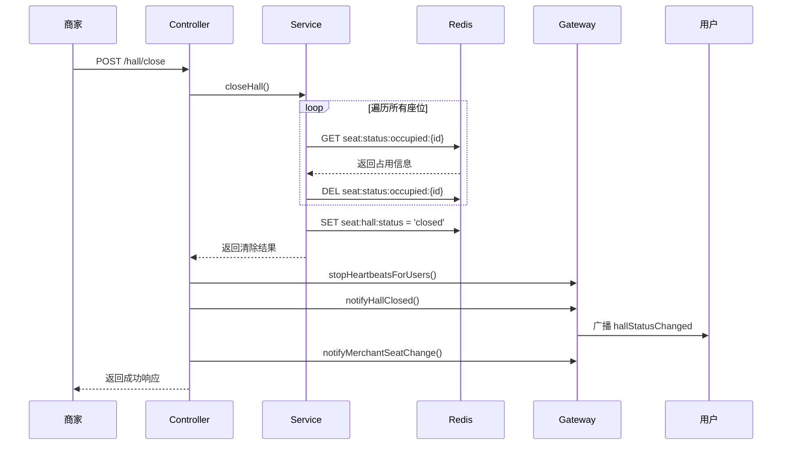
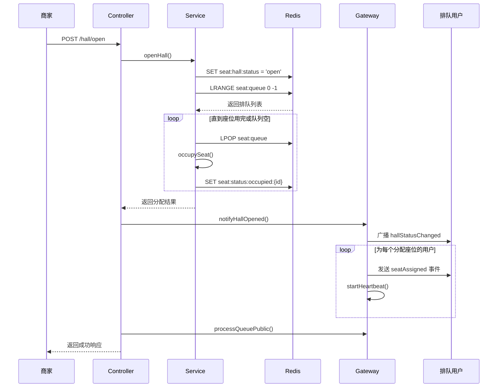
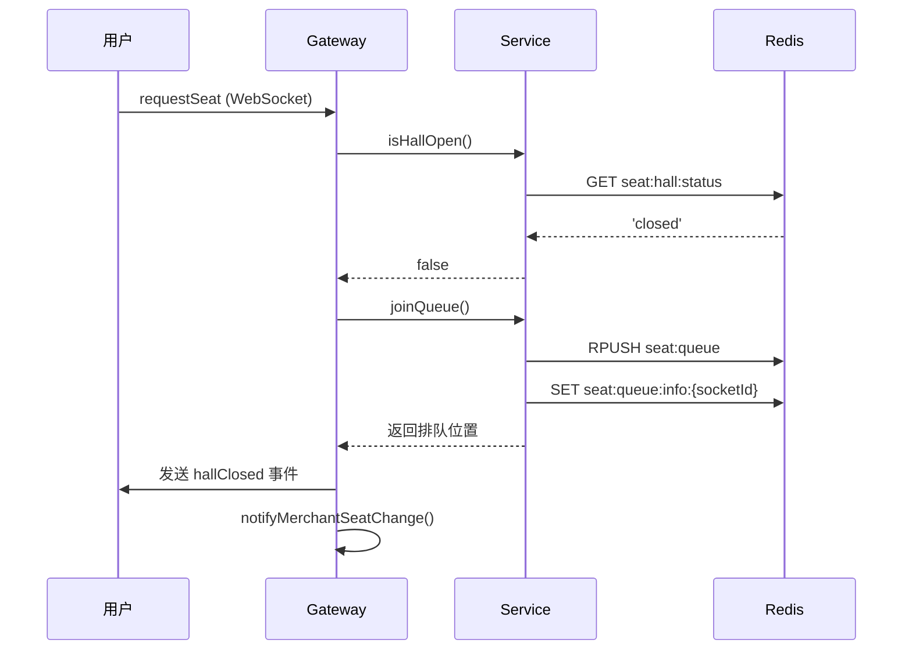

# 座位管理系统 - 大厅开关门功能实现文档

## 系统概述

本文档描述座位管理系统新增的**大厅开关门功能**，该功能允许商家控制大厅的开放状态，实现以下业务需求：

1. **关门**：清空所有座位占用信息，用户只能进入排队状态，不能直接上座
2. **开门**：按排队顺序为用户分配座位，恢复正常座位分配流程

---

## 功能特性

### 1. 关门功能（Close Hall）

**触发方式**: 商家通过 API 或管理后台操作

**执行逻辑**:
1. 清空 Redis 中所有座位的占用信息（`seat:status:occupied:*`）
2. **清空所有排队记录**（`seat:queue` 和 `seat:queue:info:*`）
3. 停止所有被清除用户的心跳检测
4. 设置大厅状态为 `closed`（存储在 Redis: `seat:hall:status`）
5. 通过 WebSocket 广播 `hallStatusChanged` 事件给所有客户端

**业务影响**:
- 所有在座用户被移出座位
- 所有排队记录被清空
- 新用户请求座位时强制进入排队状态（重新开始排队）
- 关门时Redis中的所有座位相关数据都会被清空
- **所有在线用户收到关门通知后自动退出聊天界面**

---

### 2. 开门功能（Open Hall）

**触发方式**: 商家通过 API 或管理后台操作

**执行逻辑**:
1. 设置大厅状态为 `open`（更新 Redis: `seat:hall:status`）
2. 读取排队列表（按 FIFO 顺序）
3. 获取可用座位列表
4. 按顺序为排队用户分配座位（直到座位用完或队列为空）
5. 为每个被分配座位的用户：
   - 写入 Redis 占用信息
   - 发送 `seatAssigned` WebSocket 事件
   - 启动心跳检测
6. 通过 WebSocket 广播 `hallStatusChanged` 事件
7. 更新商家端座位状态

**业务影响**:
- 恢复正常座位分配流程
- 排队用户按顺序上座
- 新用户可以直接请求座位（如果有空位）

---

### 3. 大厅状态检测

**关门状态下的用户行为**:
- 用户发送 `requestSeat` 事件
- 系统检测到大厅状态为 `closed`
- 强制用户进入排队队列
- 返回 `hallClosed` 事件，包含排队位置信息
- **不分配座位**，即使有空座位

**开门状态下的用户行为**:
- 正常座位分配流程
- 有空位直接分配，无空位排队

---

## 架构设计

### Redis 数据结构

#### 新增 Key

| Key | 类型 | 说明 | 值 |
|-----|------|------|-----|
| `seat:hall:status` | String | 大厅开关门状态 | `open` 或 `closed` |

#### 现有 Key（保持不变）

| Key | 类型 | 说明 |
|-----|------|------|
| `seat:status:occupied:{seatId}` | String (JSON) | 座位占用信息 |
| `seat:queue` | List | 排队队列（socketId） |
| `seat:queue:info:{socketId}` | String (JSON) | 排队详细信息 |

---

## 技术实现

### 1. Service 层实现 (seat.service.ts)

#### 新增常量

```typescript
const HALL_STATUS_KEY = 'seat:hall:status'; // 大厅状态
```

#### 核心方法

##### 1.1 关门方法

```typescript
async closeHall(): Promise<{ 
  message: string; 
  clearedSeats: number;
  clearedSocketIds: string[];
}> {
  // 1. 获取所有座位
  const allSeats = await this.findAll();
  let clearedCount = 0;
  const clearedSocketIds: string[] = [];

  // 2. 清空所有座位占用信息
  for (const seat of allSeats) {
    const occupiedInfoStr = await this.redisService.get(
      `${SEAT_STATUS_OCCUPIED_PREFIX}${seat._id}`,
    );
    if (occupiedInfoStr) {
      const occupiedInfo = JSON.parse(occupiedInfoStr);
      clearedSocketIds.push(occupiedInfo.socketId);
      
      await this.redisService.del(`${SEAT_STATUS_OCCUPIED_PREFIX}${seat._id}`);
      clearedCount++;
    }
  }

  // 3. 设置大厅状态为关闭
  await this.redisService.set(HALL_STATUS_KEY, 'closed');

  return {
    message: `大厅已关闭，清空了 ${clearedCount} 个座位的占用信息`,
    clearedSeats: clearedCount,
    clearedSocketIds,
  };
}
```

**关键点**:
- 遍历所有座位，逐个清除占用信息
- 记录被清除的 socketId，用于停止心跳
- 不清空排队队列
- 原子性：先清除座位，再更新状态

---

##### 1.2 开门方法

```typescript
async openHall(): Promise<{ message: string; assignedCount: number }> {
  // 1. 设置大厅状态为开放
  await this.redisService.set(HALL_STATUS_KEY, 'open');

  // 2. 获取排队列表和可用座位
  const queueList = await this.getQueueList();
  const availableSeats = await this.findAvailableSeats();

  let assignedCount = 0;

  // 3. 按顺序分配座位
  while (queueList.length > 0 && availableSeats.length > 0) {
    const nextUser = await this.callNext(); // FIFO 出队
    const seat = availableSeats.shift();

    if (!nextUser || !seat) {
      break;
    }

    try {
      // 占用座位
      await this.occupySeat(
        seat._id.toString(),
        nextUser.socketId,
        nextUser.nickname,
      );

      assignedCount++;
    } catch (error) {
      // 失败则重新入队
      await this.joinQueue(
        nextUser.socketId,
        nextUser.nickname,
        nextUser.partySize,
      );
      break;
    }
  }

  return {
    message: `大厅已开放，为 ${assignedCount} 位用户分配了座位`,
    assignedCount,
  };
}
```

**关键点**:
- 先更新状态，再分配座位
- 使用 `callNext()` 保证 FIFO 顺序
- 分配失败时将用户重新入队
- 循环直到座位用完或队列为空

---

##### 1.3 状态检测方法

```typescript
// 检查大厅是否开放
async isHallOpen(): Promise<boolean> {
  const status = await this.redisService.get(HALL_STATUS_KEY);
  // 默认开放（向后兼容）
  return status !== 'closed';
}

// 获取大厅状态
async getHallStatus(): Promise<{ status: 'open' | 'closed' }> {
  const isOpen = await this.isHallOpen();
  return { status: isOpen ? 'open' : 'closed' };
}
```

---

##### 1.4 统计信息更新

```typescript
async getStatistics() {
  const seats = await this.findAll();
  const availableSeats = await this.findAvailableSeats();
  const queueLength = await this.getQueueLength();
  const hallStatus = await this.getHallStatus(); // 新增
  
  return {
    total: seats.length,
    available: availableSeats.length,
    occupied: seats.length - availableSeats.length,
    closed: 0,
    queueLength,
    hallStatus: hallStatus.status, // 新增字段
  };
}
```

---

### 2. Controller 层实现 (seat.controller.ts)

#### 新增 API 接口

```typescript
// 1. 关门接口
@Post('hall/close')
@ApiOperation({ summary: '关门（商家操作）- 清空所有座位占用信息' })
async closeHall() {
  const result = await this.seatService.closeHall();
  // 停止心跳检测
  this.seatGateway.stopHeartbeatsForUsers(result.clearedSocketIds);
  // WebSocket 通知
  this.seatGateway.notifyHallClosed();
  await this.seatGateway.notifyMerchantSeatChange();
  return {
    message: result.message,
    clearedSeats: result.clearedSeats,
  };
}

// 2. 开门接口
@Post('hall/open')
@ApiOperation({ summary: '开门（商家操作）- 按排队顺序分配座位' })
async openHall() {
  const result = await this.seatService.openHall();
  // WebSocket 通知
  this.seatGateway.notifyHallOpened();
  await this.seatGateway.notifyMerchantSeatChange();
  // 处理剩余队列
  await this.seatGateway.processQueuePublic();
  return result;
}

// 3. 查询大厅状态接口
@Get('hall/status')
@ApiOperation({ summary: '获取大厅状态' })
getHallStatus() {
  return this.seatService.getHallStatus();
}
```

---

### 3. Gateway 层实现 (seat.gateway.ts)

#### 3.1 修改用户请求座位逻辑

```typescript
@SubscribeMessage('requestSeat')
async handleRequestSeat(
  @ConnectedSocket() client: Socket,
  @MessageBody() data: { nickname?: string },
) {
  try {
    // 1. 检查大厅是否开放
    const isHallOpen = await this.seatService.isHallOpen();

    if (!isHallOpen) {
      // 关门状态：强制排队
      const position = await this.seatService.joinQueue(
        client.id,
        data?.nickname,
        1,
      );

      client.emit('hallClosed', {
        message: '大厅已关闭，您已自动加入排队',
        position,
        queueLength: await this.seatService.getQueueLength(),
      });

      await this.notifyMerchantSeatChange();
      return;
    }

    // 2. 开门状态：正常分配逻辑
    // ... (原有代码)
  }
}
```

**关键变更**:
- 在分配座位前检查大厅状态
- 关门时直接返回，不继续执行分配逻辑
- 发送 `hallClosed` 事件而不是 `needQueue`

---

#### 3.2 新增通知方法

```typescript
// 通知大厅关闭
notifyHallClosed() {
  this.server.emit('hallStatusChanged', {
    status: 'closed',
    message: '大厅已关闭，所有用户已被移出座位',
    timestamp: new Date().toISOString(),
  });
}

// 通知大厅开放
notifyHallOpened() {
  this.server.emit('hallStatusChanged', {
    status: 'open',
    message: '大厅已开放，正在为排队用户分配座位',
    timestamp: new Date().toISOString(),
  });
}

// 批量停止心跳检测
stopHeartbeatsForUsers(socketIds: string[]) {
  socketIds.forEach(socketId => {
    this.stopHeartbeat(socketId);
  });
  this.logger.log(`Stopped heartbeats for ${socketIds.length} users`);
}

// 公开队列处理方法
async processQueuePublic() {
  await this.processQueue();
}
```

---

## API 接口文档

### 1. 关门接口

**Endpoint**: `POST /api/seats/hall/close`

**请求参数**: 无

**响应示例**:
```json
{
  "message": "大厅已关闭，清空了 5 个座位的占用信息，3 个排队记录",
  "clearedSeats": 5,
  "clearedQueue": 3
}
```

**业务影响**:
- 所有在座用户被移出
- 所有排队记录被清空
- 大厅状态变为 `closed`
- 触发 `hallStatusChanged` 广播

---

### 2. 开门接口

**Endpoint**: `POST /api/seats/hall/open`

**请求参数**: 无

**响应示例**:
```json
{
  "message": "大厅已开放，为 3 位用户分配了座位",
  "assignedCount": 3
}
```

**业务影响**:
- 大厅状态变为 `open`
- 排队用户按顺序上座
- 触发 `hallStatusChanged` 广播
- 被分配座位的用户收到 `seatAssigned` 事件

---

### 3. 查询大厅状态接口

**Endpoint**: `GET /api/seats/hall/status`

**请求参数**: 无

**响应示例**:
```json
{
  "status": "open"  // 或 "closed"
}
```

---

### 4. 座位统计接口（更新）

**Endpoint**: `GET /api/seats/statistics`

**响应示例**:
```json
{
  "total": 10,
  "available": 7,
  "occupied": 3,
  "closed": 0,
  "queueLength": 5,
  "hallStatus": "open"  // 新增字段
}
```

---

## WebSocket 事件文档

### 客户端监听事件

#### 1. hallStatusChanged - 大厅状态变更

**触发时机**: 商家执行关门或开门操作

**事件数据**:
```javascript
{
  status: 'open' | 'closed',
  message: string,
  timestamp: string (ISO 8601)
}
```

**前端处理**:
```javascript
socket.on('hallStatusChanged', (data) => {
  if (data.status === 'closed') {
    // 大厅关闭，退出聊天界面
    Toast.show({
      icon: 'fail',
      content: '大厅已打烊，感谢您的光临！',
      duration: 3000,
      afterClose: () => {
        // 断开socket连接
        if (socket) {
          socket.disconnect();
        }
        // 返回角色选择页面
        navigate('/role-select', { replace: true });
      },
    });
  } else if (data.status === 'open') {
    Toast.show({
      icon: 'success',
      content: '大厅已开放，欢迎光临！',
      duration: 2000,
    });
  }
});
```

---

#### 2. hallClosed - 大厅关闭强制排队

**触发时机**: 用户在大厅关闭时请求座位

**事件数据**:
```javascript
{
  message: string,
  position: number,
  queueLength: number
}
```

**示例**:
```javascript
socket.on('hallClosed', (data) => {
  console.log(`大厅已关闭，您在第 ${data.position} 位排队`);
  // 显示排队界面
  showQueueUI(data.position, data.queueLength);
});
```

---

#### 3. merchantSeatUpdate - 商家端状态更新

**更新内容**: 增加 `statistics.hallStatus` 字段

```javascript
{
  seats: [...],
  statistics: {
    total: 10,
    available: 7,
    occupied: 3,
    queueLength: 5,
    hallStatus: 'open' | 'closed'  // 新增
  },
  queueList: [...],
  timestamp: string
}
```

---

## 数据流程图

### 关门流程



---

### 开门流程



---

### 关门状态下用户请求座位流程



---

## 使用指南

### 商家端使用

#### 1. 关门操作

**使用场景**:
- 餐厅打烊前
- 系统维护
- 临时暂停服务

**操作步骤**:
```bash
curl -X POST http://localhost:3001/api/seats/hall/close
```

**效果**:
- 所有在座用户被移出
- 新用户只能排队
- 排队用户保持排队状态

---

#### 2. 开门操作

**使用场景**:
- 餐厅开始营业
- 恢复正常服务

**操作步骤**:
```bash
curl -X POST http://localhost:3001/api/seats/hall/open
```

**效果**:
- 恢复正常座位分配
- 排队用户按顺序上座
- 新用户可以直接请求座位

---

### 客户端集成

#### React 示例

```typescript
import { useEffect, useState } from 'react';
import { io } from 'socket.io-client';

function ChatRoom() {
  const [hallStatus, setHallStatus] = useState<'open' | 'closed'>('open');
  const [socket, setSocket] = useState(null);

  useEffect(() => {
    const newSocket = io('http://localhost:3001/seat');
    setSocket(newSocket);

    // 监听大厅状态变更
    newSocket.on('hallStatusChanged', (data) => {
      setHallStatus(data.status);
      alert(data.message);
    });

    // 监听关门强制排队
    newSocket.on('hallClosed', (data) => {
      console.log(`已加入排队，位置：${data.position}`);
      // 显示排队界面
    });

    return () => {
      newSocket.close();
    };
  }, []);

  const requestSeat = () => {
    socket.emit('requestSeat', { nickname: '用户A' });
  };

  return (
    <div>
      <p>大厅状态: {hallStatus === 'open' ? '开放' : '关闭'}</p>
      <button onClick={requestSeat}>请求座位</button>
    </div>
  );
}
```

---

## 部署运行

### 1. 环境要求

- Node.js >= 16
- Redis >= 6.0
- MongoDB >= 4.4

### 2. 启动服务

```bash
cd ChatBackEnd
npm install
npm run start:dev
```

### 3. Redis 数据初始化

首次部署时，大厅状态默认为 `open`（向后兼容）。

如需手动设置：
```bash
redis-cli SET seat:hall:status "open"
```

---

## 测试说明

详细测试用例请参考：[hall-open-close.testcase.md](./hall-open-close.testcase.md)

### 快速测试

```bash
# 1. 关门
curl -X POST http://localhost:3001/api/seats/hall/close

# 2. 验证：查询大厅状态
curl http://localhost:3001/api/seats/hall/status
# 预期: {"status":"closed"}

# 3. 开门
curl -X POST http://localhost:3001/api/seats/hall/open

# 4. 验证：查询大厅状态
curl http://localhost:3001/api/seats/hall/status
# 预期: {"status":"open"}
```

---

## 故障排查

### 问题 1: 关门后用户仍能上座

**原因**: 客户端没有正确监听 `hallClosed` 事件

**解决方案**:
```javascript
socket.on('hallClosed', (data) => {
  // 强制显示排队界面
  showQueueUI();
});
```

---

### 问题 2: 开门后排队用户没有自动上座

**原因**: `processQueuePublic()` 未被调用

**检查**:
```typescript
// seat.controller.ts 中确保有此行
await this.seatGateway.processQueuePublic();
```

---

### 问题 3: Redis 中大厅状态丢失

**原因**: Redis 数据被清空

**解决方案**:
```bash
# 重新设置默认状态
redis-cli SET seat:hall:status "open"
```

---

### 问题 4: 心跳检测未停止

**原因**: `stopHeartbeatsForUsers()` 未被调用

**检查**:
```typescript
// seat.controller.ts closeHall() 方法中
this.seatGateway.stopHeartbeatsForUsers(result.clearedSocketIds);
```

---

## 性能优化建议

### 1. 批量清理座位

当前实现是逐个清理，可以优化为批量操作：

```typescript
// 使用 Redis Pipeline
const pipeline = this.redisService.multi();
for (const seat of allSeats) {
  pipeline.del(`${SEAT_STATUS_OCCUPIED_PREFIX}${seat._id}`);
}
await pipeline.exec();
```

### 2. 开门时分批分配

如果排队人数很多，可以分批分配座位，避免阻塞：

```typescript
const BATCH_SIZE = 10;
for (let i = 0; i < Math.min(queueLength, BATCH_SIZE); i++) {
  // 分配座位
}
```

---

## 安全考虑

### 1. 权限控制

关门/开门操作应该只允许商家执行：

```typescript
@UseGuards(AuthGuard, RoleGuard)
@Roles('merchant', 'admin')
@Post('hall/close')
async closeHall() {
  // ...
}
```

### 2. 操作日志

记录关门/开门操作：

```typescript
this.logger.log(`Hall closed by merchant ${userId} at ${new Date()}`);
```

---

## 未来扩展

### 1. 定时开关门

支持设置营业时间，自动开关门：

```typescript
@Cron('0 9 * * *')  // 每天9点开门
async autoOpenHall() {
  await this.openHall();
}

@Cron('0 22 * * *')  // 每天22点关门
async autoCloseHall() {
  await this.closeHall();
}
```

### 2. 关门提醒

关门前5分钟提醒用户：

```typescript
@Cron('55 21 * * *')  // 21:55
async remindClosing() {
  this.server.emit('closingSoon', {
    message: '大厅将在5分钟后关闭',
  });
}
```

### 3. 关门原因记录

支持记录关门原因：

```typescript
async closeHall(reason?: string) {
  // 存储关门原因
  await this.redisService.set('seat:hall:close:reason', reason);
}
```

---

## 版本历史

| 版本 | 日期 | 变更内容 |
|------|------|----------|
| 1.0.0 | 2026-01-29 | 初始版本：实现基础开关门功能 |

---

## 总结

大厅开关门功能已成功实现，主要特性包括：

✅ 商家可通过 API 控制大厅开关状态  
✅ 关门时清空所有座位，用户只能排队  
✅ 开门时按顺序为排队用户分配座位  
✅ WebSocket 实时通知所有客户端  
✅ 心跳检测正确管理  
✅ 向后兼容，默认为开放状态  

该功能为座位管理系统提供了更灵活的运营控制能力。
