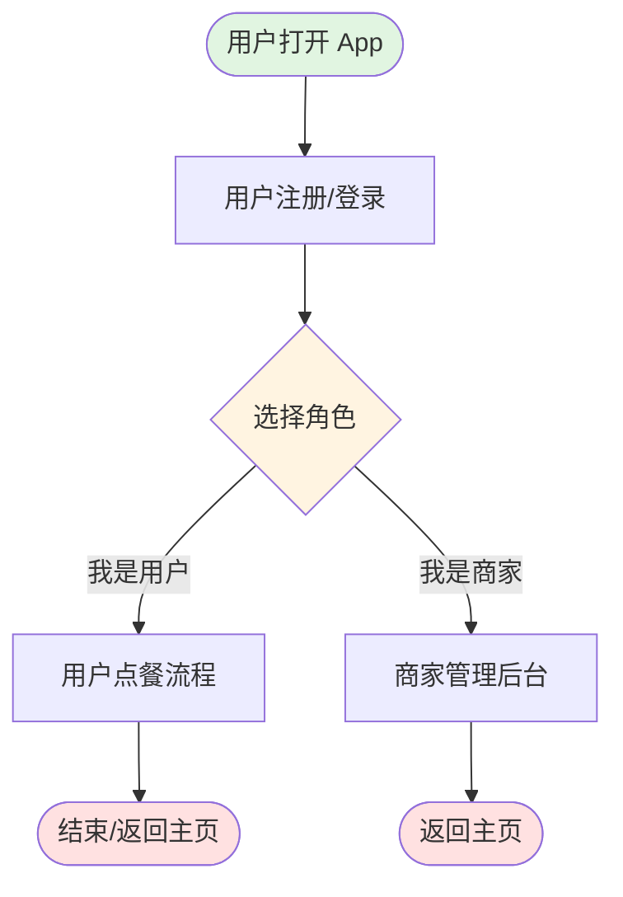
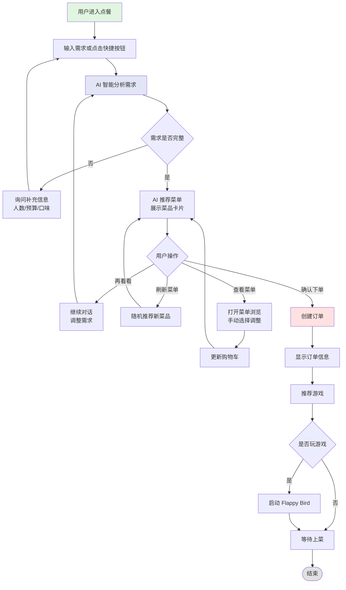
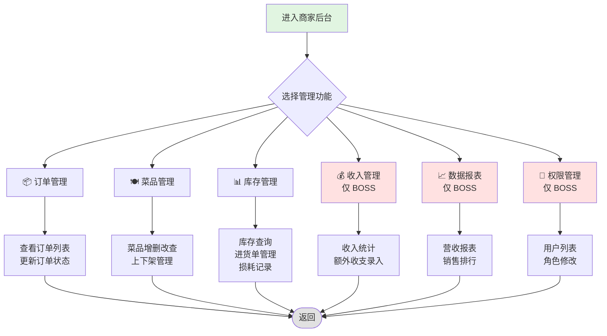
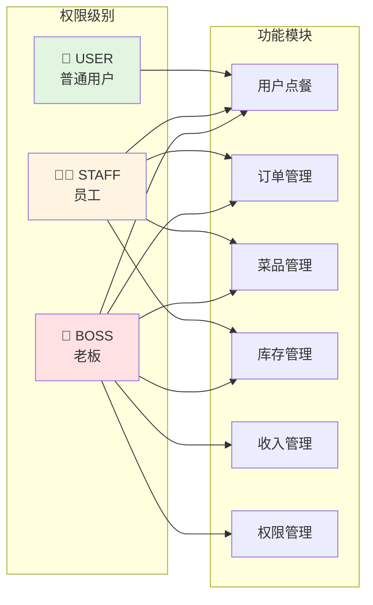
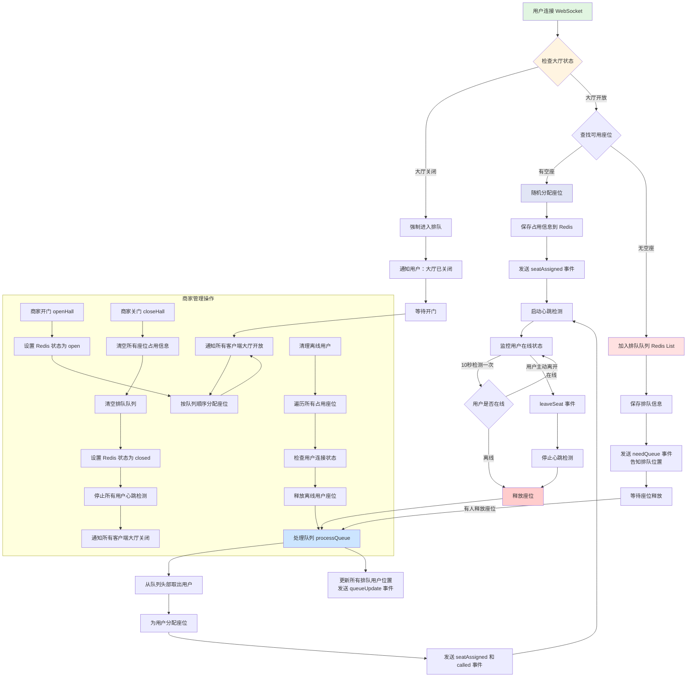
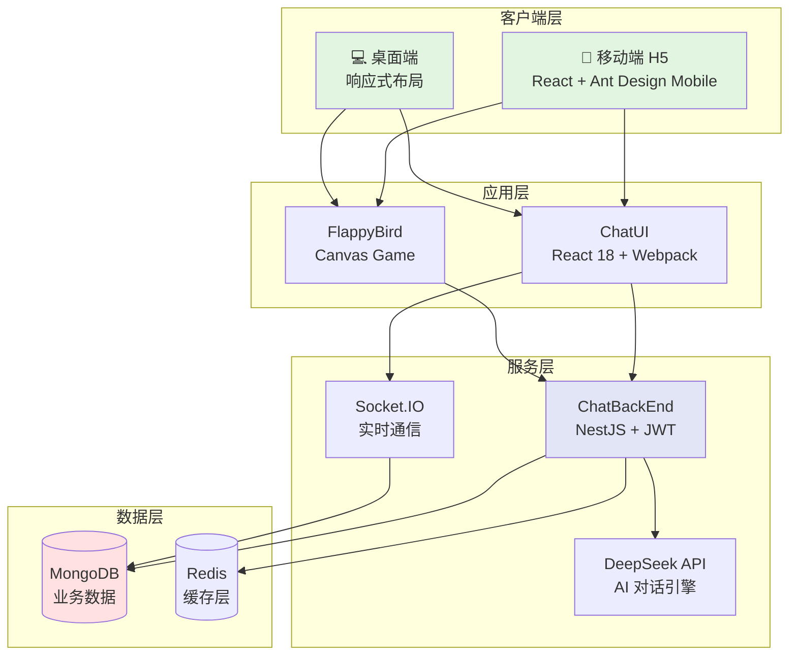
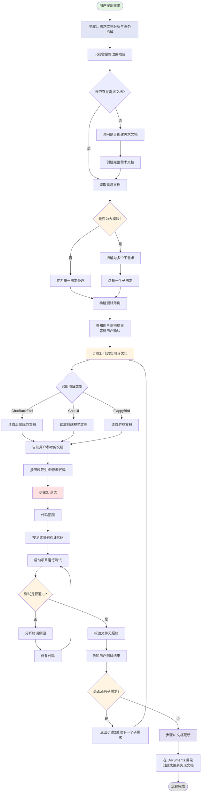

# 🍜 Ai Chat - 智能餐厅点餐系统

<div align="center">

一个基于 AI 的智能餐厅管理系统，集成了智能点餐、商家管理和游戏娱乐功能的全栈应用。

[](LICENSE)
[](https://nestjs.com/)
[](https://reactjs.org/)
[](https://www.mongodb.com/)

</div>

---

## 📋 目录

- [项目简介](#-项目简介)
- [核心功能](#-核心功能)
- [业务流程图](#-业务流程图)
- [技术架构](#-技术架构)
- [项目结构](#-项目结构)
- [快速开始](#-快速开始)
- [部署指南](#-部署指南)
- [API 文档](#-api-文档)
- [开发规范](#-开发规范)

---

## 🎯 项目简介

**Ai Chat** 是一个现代化的智能餐厅管理系统，通过 AI 技术为用户提供自然语言点餐体验，为商家提供完整的后台管理功能。系统涵盖了从用户点餐到订单管理、库存管理、财务统计的完整业务闭环。

### 🌟 系统亮点

- **🤖 AI 智能点餐**: 基于 DeepSeek API 的自然语言对话，智能理解用户需求
- **📊 数据可视化**: 实时营收统计、销售排行、库存预警
- **🎮 游戏互动**: 内置 Flappy Bird 游戏，提升用户等餐体验
- **🔐 权限管理**: 细粒度的角色权限控制（USER/STAFF/BOSS）
- **📱 移动优先**: 基于 Ant Design Mobile 的响应式设计
- **🐳 容器化部署**: Docker Compose 一键部署，支持生产环境

---

## ✨ 核心功能

### 用户端功能
| 功能 | 描述 | 状态 |
|------|------|------|
| 🎤 AI 智能点餐 | 通过自然语言对话完成点餐，支持人数、预算、忌口等需求分析 | ✅ |
| 🛒 购物车管理 | 实时查看和修改购物车，支持菜品增删改 | ✅ |
| 📝 订单查询 | 查看历史订单和当前订单状态 | ✅ |
| 🎮 游戏娱乐 | 等餐期间体验 Flappy Bird 游戏，并参与排行榜竞争 | ✅ |
| 👤 用户注册登录 | 快速注册和角色选择（用户/员工/老板） | ✅ |

### 商家端功能
| 模块 | 功能 | 权限要求 |
|------|------|----------|
| 📦 订单管理 | 查看订单列表、更新订单状态、订单详情 | STAFF+ |
| 🍽️ 菜品管理 | 菜品增删改查、上下架、分类管理 | STAFF+ |
| 📊 库存管理 | 库存查询、进货单管理、损耗记录、低库存预警 | STAFF+ |
| 💰 收入管理 | 当日/月度/总体收入统计、额外收支录入、毛利率分析 | BOSS |
| 📈 数据报表 | 营收统计、销售排行、数据可视化图表 | BOSS |
| 👥 权限管理 | 用户列表、角色修改、权限控制 | BOSS |
| 🪑 座位管理 | 座位状态管理、座位分配 | STAFF+ |
| 🏆 游戏排行榜 | 查看玩家游戏分数排行 | STAFF+ |

---

## 📊 业务流程图

### 系统总体流程



### 用户点餐流程



### 商家管理流程



### 权限控制矩阵



### 座位管理流程



---

## 🏗️ 技术架构

### 系统架构图



### 技术栈详情

#### 后端技术栈 (ChatBackEnd)

| 技术 | 版本 | 用途 |
|------|------|------|
| **NestJS** | 11.0 | 企业级 Node.js 框架，提供模块化架构 |
| **MongoDB** | 9.1 | NoSQL 数据库，存储业务数据 |
| **Mongoose** | 11.0 | MongoDB ODM，提供数据建模 |
| **JWT** | 11.0 | JSON Web Token 认证 |
| **Socket.IO** | 4.8 | WebSocket 实时通信 |
| **class-validator** | 0.14 | DTO 数据验证 |
| **Swagger** | 11.2 | API 文档自动生成 |
| **Redis** | 5.10 | 缓存和会话管理 |
| **DeepSeek API** | - | AI 对话能力 |

#### 前端技术栈 (ChatUI)

| 技术 | 版本 | 用途 |
|------|------|------|
| **React** | 18.2 | 前端框架 |
| **Ant Design Mobile** | 5.34 | 移动端 UI 组件库 |
| **React Router** | 6.8 | 单页应用路由 |
| **Webpack** | 5.75 | 模块打包工具 |
| **Socket.IO Client** | 4.8 | WebSocket 客户端 |
| **Axios** | 1.13 | HTTP 请求库 |

#### 游戏技术栈 (FlappyBird)

| 技术 | 版本 | 用途 |
|------|------|------|
| **React** | 18.2 | 游戏框架 |
| **Canvas API** | - | 游戏渲染 |
| **Web Audio API** | - | 音效系统 |

---

## 📁 项目结构

```
Ai-chat-Demo/
├── ChatBackEnd/              # 后端服务 (NestJS)
│   ├── src/
│   │   ├── modules/          # 功能模块
│   │   │   ├── auth/         # 认证模块 - JWT 认证、用户注册登录
│   │   │   ├── ordering/     # 点餐模块 - AI 对话、订单管理、购物车
│   │   │   ├── dish/         # 菜品模块 - 菜品 CRUD、分类管理
│   │   │   ├── inventory/    # 库存模块 - 库存管理、进货单、损耗记录
│   │   │   ├── seat/         # 座位模块 - 座位管理和分配
│   │   │   ├── users/        # 用户模块 - 用户信息管理
│   │   │   ├── revenue/      # 收入管理模块 - 财务统计、收支管理
│   │   │   ├── game/         # 游戏模块 - 排行榜管理
│   │   │   └── category/     # 分类模块 - 菜品分类管理
│   │   ├── common/           # 公共模块
│   │   │   ├── guards/       # 守卫 - JWT、角色权限
│   │   │   ├── decorators/   # 装饰器 - 权限装饰器
│   │   │   └── filters/      # 过滤器 - 异常处理
│   │   ├── schemas/          # MongoDB Schema 定义
│   │   ├── scripts/          # 工具脚本
│   │   └── app.module.ts     # 应用主模块
│   ├── test/                 # 测试脚本
│   ├── Dockerfile            # Docker 构建文件
│   └── package.json          # 依赖配置
│
├── ChatUI/                   # 前端应用 (React)
│   ├── src/
│   │   ├── pages/            # 页面组件
│   │   │   ├── Register/           # 用户注册页面
│   │   │   ├── RoleSelect/         # 角色选择页面
│   │   │   ├── UserOrder/          # 用户点餐页面
│   │   │   ├── MerchantDashboard/  # 商家主面板
│   │   │   ├── OrderManagement/    # 订单管理页面
│   │   │   ├── DishManagement/     # 菜品管理页面
│   │   │   ├── InventoryManagement/# 库存管理页面
│   │   │   ├── RevenueManagement/  # 收入管理页面
│   │   │   ├── RevenueStats/       # 收入统计页面
│   │   │   ├── PermissionManagement/# 权限管理页面
│   │   │   ├── GameLeaderboard/    # 游戏排行榜页面
│   │   │   └── SeatManagement/     # 座位管理页面
│   │   ├── api/              # API 客户端封装
│   │   ├── utils/            # 工具函数
│   │   ├── contexts/         # React Context (认证状态等)
│   │   └── App.jsx           # 应用入口
│   ├── public/               # 静态资源
│   ├── nginx.conf            # Nginx 配置
│   ├── Dockerfile            # Docker 构建文件
│   └── package.json          # 依赖配置
│
├── FlappyBird/               # 游戏应用 (React Canvas)
│   ├── src/
│   │   ├── game/             # 游戏逻辑
│   │   ├── components/       # 游戏组件
│   │   └── utils/            # 工具函数
│   ├── public/               # 游戏资源
│   ├── Dockerfile            # Docker 构建文件
│   └── package.json          # 依赖配置
│
├── Documents/                # 需求文档和 API 文档
│   ├── all-process.md        # 全业务流程说明
│   ├── FEATURES.md           # 功能清单
│   ├── deployment-guide.md   # 部署指南
│   ├── auth/                 # 认证模块文档
│   ├── ordering/             # 点餐模块文档
│   ├── dish/                 # 菜品模块文档
│   ├── inventory/            # 库存模块文档
│   ├── revenue/              # 收入管理文档
│   ├── permission-management/# 权限管理文档
│   ├── game-leaderboard/     # 游戏排行榜文档
│   ├── seat/                 # 座位管理文档
│   ├── docker/               # Docker 部署文档
│   └── ecs/                  # 阿里云 ECS 部署文档
│
├── mongo-data/               # MongoDB 数据目录 (Docker Volume)
│
├── docker-compose.yml        # Docker Compose 主配置
├── docker-compose.db.yml     # 数据库服务配置
├── docker-compose.game.yml   # 游戏服务配置
├── start.sh                  # 开发环境启动脚本
├── start-separated.sh        # 生产环境启动脚本
├── stop.sh                   # 停止脚本
├── deploy-to-aliyun.sh       # 阿里云部署脚本
└── README.md                 # 项目说明文档
```

---

## 🚀 快速开始

### 环境要求

- **Node.js**: 16.x 或更高版本
- **MongoDB**: 6.0 或更高版本
- **npm** 或 **yarn**: 最新版本
- **Docker** (可选): 用于容器化部署

### 本地开发环境搭建

#### 1. 克隆项目

```bash
git clone https://github.com/your-username/Ai-chat-Demo.git
cd Ai-chat-Demo
```

#### 2. 配置环境变量

**后端配置** (ChatBackEnd/.env)
```env
# 服务配置
NODE_ENV=development
PORT=3001
HOST=0.0.0.0

# MongoDB 配置
MONGODB_URI=mongodb://localhost:27017/ai-chat

# DeepSeek API 配置
DEEPSEEK_API_KEY=your_deepseek_api_key
DEEPSEEK_API_BASE_URL=https://api.deepseek.com/v1

# JWT 配置
JWT_SECRET=your_jwt_secret_here
JWT_EXPIRES_IN=7d

# CORS 配置
ALLOWED_ORIGINS=http://localhost:8080,http://localhost:3000
```

**前端配置** (ChatUI/.env.development)
```env
NODE_ENV=development

# API 地址配置（开发环境使用绝对路径）
REACT_APP_API_URL=http://localhost:3001/api
REACT_APP_SOCKET_URL=http://localhost:3001
```

#### 3. 启动 MongoDB

```bash
# macOS (使用 Homebrew)
brew services start mongodb-community

# Linux
sudo systemctl start mongod

# 或使用 Docker
docker run -d -p 27017:27017 --name mongodb mongo:latest
```

#### 4. 安装依赖并启动服务

**方式一：使用启动脚本 (推荐)**

```bash
# 一键启动后端、前端和游戏
./start.sh
```

**方式二：分别启动各服务**

```bash
# 启动后端 (终端1)
cd ChatBackEnd
npm install
npm run start:dev
# 后端运行在 http://localhost:3001

# 启动前端 (终端2)
cd ChatUI
npm install
npm run dev
# 前端运行在 http://localhost:8080

# 启动游戏 (终端3)
cd FlappyBird
npm install
npm start
# 游戏运行在 http://localhost:8082
```

#### 5. 访问应用

- **前端应用**: http://localhost:8080
- **后端 API**: http://localhost:3001/api
- **API 文档**: http://localhost:3001/api-docs (Swagger)
- **游戏应用**: http://localhost:8082

### 初始化测试数据

```bash
cd ChatBackEnd

# 随机分配菜品分类
npm run random-assign-category

# 更新菜品信息
npm run update-dishes
```

---

## 🐳 部署指南

### Docker 本地部署

#### 1. 使用 Docker Compose 启动

```bash
# 启动所有服务 (后端 + 前端 + 游戏 + MongoDB)
docker-compose up -d

# 查看服务状态
docker-compose ps

# 查看日志
docker-compose logs -f

# 停止服务
./stop.sh
# 或
docker-compose down
```

#### 2. 访问服务

- **前端应用**: http://localhost:3000
- **后端 API**: http://localhost:3001/api
- **游戏应用**: http://localhost:3002
- **MongoDB**: localhost:27017

### 生产环境部署

#### 配置生产环境变量

**后端配置** (ChatBackEnd/.env.production)
```env
NODE_ENV=production
PORT=3001
HOST=0.0.0.0

# 生产数据库配置
MONGODB_URI=mongodb://mongodb:27017/ai-chat

# CORS 配置（添加生产域名）
ALLOWED_ORIGINS=http://your-domain.com,http://your-domain.com:3000

# DeepSeek API
DEEPSEEK_API_KEY=your_production_api_key
DEEPSEEK_API_BASE_URL=https://api.deepseek.com/v1

# JWT 配置（使用强密钥）
JWT_SECRET=your_strong_jwt_secret_for_production
JWT_EXPIRES_IN=7d
```

**前端配置** (ChatUI/.env.production)
```env
NODE_ENV=production

# 生产环境使用相对路径，通过 nginx 代理
# 不需要设置 REACT_APP_API_URL 和 REACT_APP_SOCKET_URL

# 如果需要跨域部署，才设置：
# REACT_APP_API_URL=http://your-domain.com:3001/api
# REACT_APP_SOCKET_URL=http://your-domain.com:3001
```

#### 使用启动脚本部署

```bash
# 生产环境启动（使用 nginx 代理）
./start-separated.sh

# 查看服务状态
docker-compose -f docker-compose.yml ps
```

### 阿里云 ECS 部署

```bash
# 自动化部署到阿里云
./deploy-to-aliyun.sh

# 访问地址
# 主应用: http://your-server-ip:3000
# 后端 API: http://your-server-ip:3001/api
# 游戏: http://your-server-ip:3002
```

**详细部署文档**: [Documents/deployment-guide.md](Documents/deployment-guide.md)

---

## 📚 API 文档

### API 接口概览

#### 认证接口 (`/api/auth`)

| 方法 | 路径 | 描述 | 权限 |
|------|------|------|------|
| POST | `/register` | 用户注册 | Public |
| POST | `/login` | 用户登录 | Public |
| GET | `/me` | 获取当前用户信息 | Auth |

#### 点餐接口 (`/api/ordering`)

| 方法 | 路径 | 描述 | 权限 |
|------|------|------|------|
| POST | `/chat` | AI 点餐对话 | USER+ |
| GET | `/cart/:userId` | 获取购物车 | USER+ |
| POST | `/create` | 创建订单 | USER+ |
| GET | `/list` | 获取订单列表 | STAFF+ |
| PATCH | `/:orderId/status` | 更新订单状态 | STAFF+ |
| GET | `/reports/today-revenue` | 今日收入统计 | BOSS |
| GET | `/reports/dish-ranking` | 菜品销售排行 | BOSS |

#### 菜品接口 (`/api/dishes`)

| 方法 | 路径 | 描述 | 权限 |
|------|------|------|------|
| GET | `/` | 获取菜品列表 | Public |
| GET | `/:id` | 获取菜品详情 | Public |
| POST | `/` | 创建菜品 | STAFF+ |
| PATCH | `/:id` | 更新菜品 | STAFF+ |
| DELETE | `/:id` | 删除菜品 | STAFF+ |
| PATCH | `/:id/status` | 上下架菜品 | STAFF+ |

#### 库存接口 (`/api/inventory`)

| 方法 | 路径 | 描述 | 权限 |
|------|------|------|------|
| GET | `/` | 获取库存列表 | STAFF+ |
| POST | `/` | 创建库存记录 | STAFF+ |
| PATCH | `/:id` | 更新库存 | STAFF+ |
| GET | `/:id/history` | 库存变动历史 | STAFF+ |
| GET | `/low-stock` | 低库存预警 | STAFF+ |

#### 进货单接口 (`/api/purchase-order`)

| 方法 | 路径 | 描述 | 权限 |
|------|------|------|------|
| POST | `/` | 创建进货单 | STAFF+ |
| GET | `/` | 获取进货单列表 | STAFF+ |
| POST | `/:id/approve` | 审批进货单 | BOSS |
| POST | `/:id/receive` | 确认入库 | STAFF+ |

#### 收入管理接口 (`/api/revenue`)

| 方法 | 路径 | 描述 | 权限 |
|------|------|------|------|
| GET | `/stats/today` | 当日收入统计 | BOSS |
| GET | `/stats/month` | 月度收入统计 | BOSS |
| GET | `/stats/total` | 总体收入统计 | BOSS |
| POST | `/transactions/batch` | 批量创建额外收支 | BOSS |
| GET | `/transactions` | 查询额外收支 | BOSS |
| DELETE | `/transactions/:id` | 删除额外收支 | BOSS |

#### 用户管理接口 (`/api/users`)

| 方法 | 路径 | 描述 | 权限 |
|------|------|------|------|
| GET | `/list` | 获取用户列表 | BOSS |
| PATCH | `/:userId/role` | 更新用户角色 | BOSS |

#### 游戏接口 (`/api/game`)

| 方法 | 路径 | 描述 | 权限 |
|------|------|------|------|
| POST | `/leaderboard` | 提交游戏分数 | Auth |
| GET | `/leaderboard` | 获取排行榜 | Public |

**完整 API 文档**: 启动后端后访问 http://localhost:3001/api-docs

---

## 📖 开发规范

### 代码规范

- **后端规范**: [.github/skills/bankend/SKILL.md](.github/skills/bankend/SKILL.md)
- **前端规范**: [.github/skills/fontend/SKILL.md](.github/skills/fontend/SKILL.md)

### Git 提交规范

```bash
feat: 新功能
fix: 修复bug
docs: 文档更新
style: 代码格式调整
refactor: 重构代码
test: 测试相关
chore: 构建或辅助工具变动
```

---

## 🤖 AI 开发助手流程 (Code-Generate Agent)

本项目提供了一个完整的 AI 开发助手，帮助开发者按照项目规范完成从需求分析到代码实现到测试验证的完整开发流程。

### 使用方式

使用 GitHub Copilot 的 agent 模式，输入 `@code-generate` 并描述你要实现的功能需求。

### 开发流程



### 流程详解

#### 步骤1: 需求文档分析与任务拆解

1. **项目识别**: 自动识别需要修改的项目（ChatBackEnd/ChatUI/FlappyBird）
2. **需求文档检查**: 
   - 如果需求文档不存在，询问是否创建
   - 需求文档包含：系统概述、架构设计、功能特性、技术实现、API 文档、数据模型、使用指南
3. **任务拆解**: 
   - 大模块拆解为多个子需求
   - 每次只处理一个子需求
4. **测试用例生成**: 
   - 输出到 `Documents/${module}/${module}.testcase.md`
   - 对比现有测试用例，识别变更
5. **用户确认**: 告知识别结果，等待用户确认后继续

#### 步骤2: 代码实现与优化

1. **读取规范文档**:
   - ChatBackEnd: [backend-instructions.md](.github/agents/backend-instructions.md)
   - ChatUI: [fontend-instructions.md](.github/agents/fontend-instructions.md), [web-ui-specification-instruction.md](.github/agents/web-ui-specification-instruction.md)
   - FlappyBird: [README.md](FlappyBird/README.md)
2. **告知用户**: 明确告知参考了哪些文档
3. **生成代码**: 严格按照项目规范和架构模式实现功能

#### 步骤3: 测试

1. **代码回顾**: 确保代码符合项目规范
2. **测试用例验证**: 按照生成的测试用例进行验证
3. **运行测试**: 启动项目，执行相关测试
4. **错误处理**: 如果测试失败，分析原因并修复
5. **报错检查**: 校验所有修改或新建的文件无编译/语法错误
6. **结果汇报**: 向用户报告测试结果

#### 步骤4: 文档更新

**仅在所有子需求完成后执行**

- 在 `Documents/` 目录下创建或更新实现文档
- 文档路径: `Documents/{module}/{module}.md`

### 支持的项目

| 项目 | 描述 | 规范文档 |
|------|------|----------|
| **ChatBackEnd** | NestJS 后端服务 | [backend-instructions.md](.github/agents/backend-instructions.md)<br/>[SKILL.md](.github/skills/bankend/SKILL.md) |
| **ChatUI** | React 前端应用 | [fontend-instructions.md](.github/agents/fontend-instructions.md)<br/>[web-ui-specification-instruction.md](.github/agents/web-ui-specification-instruction.md)<br/>[SKILL.md](.github/skills/fontend/SKILL.md) |
| **FlappyBird** | 游戏模块 | [README.md](FlappyBird/README.md) |

### 执行规则

1. ✅ **必须按顺序执行**: 不要跳过任何步骤
2. ✅ **需求优先**: 需求文档不清晰或不存在时，先与用户确认
3. ✅ **代码规范**: 严格遵循项目现有的代码风格和架构模式
4. ✅ **文档同步**: 所有子需求完成后必须更新模块文档
5. ✅ **透明沟通**: 每个步骤完成后告知用户进展
6. ✅ **代码结构完整**: 检查修改或新建的文件没有任何报错

### 启动脚本

```bash
# 前后端开发环境
./start.sh

# 游戏开发环境
./start-flappybird.sh

# 生产环境（前后端 + 游戏）
./start-separated.sh
```

### 示例对话

```
用户: @code-generate 我需要实现一个用户积分系统

Agent: 
我识别到需要修改的项目：
1. ChatBackEnd - 后端 API 实现
2. ChatUI - 前端积分展示页面

我将拆解为以下子需求：
1. 后端：创建积分数据模型和 API
2. 后端：实现积分累积规则
3. 前端：实现积分查询页面
4. 前端：实现积分历史记录展示

测试用例已生成到: Documents/points-system/points-system.testcase.md

请确认是否继续？

[用户确认后，Agent 将按照流程逐步完成每个子需求的实现和测试]
```

### 分支管理

- `main`: 主分支，稳定版本
- `develop`: 开发分支
- `feature/*`: 功能分支
- `bugfix/*`: 修复分支
- `hotfix/*`: 紧急修复分支

---

## 🛠️ 可用脚本

### 项目启动脚本

```bash
# 开发环境 - 启动所有服务
./start.sh

# 生产环境 - 使用 Docker Compose
./start-separated.sh

# 停止所有服务
./stop.sh

# 清理 Docker 容器和镜像
./clean-docker.sh

# 部署到阿里云
./deploy-to-aliyun.sh

# 连接到阿里云服务器
./ssh-connect.sh
```

### 数据管理脚本

#### 1. 随机分配分类

为数据库中的所有菜品随机分配分类。

```bash
# 方式1：使用 Shell 脚本（推荐）
./random-assign-category.sh

# 方式2：直接运行 npm 命令
cd ChatBackEnd
npm run random-assign-category
```

**功能说明**:
- 从数据库中读取所有分类和菜品
- 为每道菜品随机分配一个分类
- 显示详细的执行进度和结果

**详细文档**: [Documents/scripts/random-assign-category.md](Documents/scripts/random-assign-category.md)

#### 2. 更新菜品信息

更新特定菜品的属性（辣度、配料、烹饪时间等）。

```bash
cd ChatBackEnd
npm run update-dishes
```

#### 3. 初始化菜品数据

批量插入测试菜品数据。

```bash
node seed-dishes.js
```

### 数据管理脚本

```bash
# 随机分配菜品分类
./random-assign-category.sh
# 或
cd ChatBackEnd && npm run random-assign-category

# 更新菜品信息
cd ChatBackEnd && npm run update-dishes

# 初始化菜品数据
cd ChatBackEnd && node seed-dishes.js
```

### 开发测试脚本

```bash
# 后端开发模式 (热重载)
cd ChatBackEnd
npm run start:dev

# 前端开发模式
cd ChatUI
npm run dev

# 游戏开发模式
cd FlappyBird
npm start

# 运行单元测试
cd ChatBackEnd
npm run test

# 运行 E2E 测试
cd ChatBackEnd
npm run test:e2e

# 代码格式化
cd ChatBackEnd
npm run format

# ESLint 检查
cd ChatBackEnd
npm run lint
```

### API 测试脚本

```bash
# 测试库存管理 API
./test-inventory-api.sh

# 测试菜品配料 API
./test-dish-ingredients.sh

# 测试收入管理 API
./test-revenue-api.sh
```

---

## 📊 项目特色功能

### 🤖 AI 智能点餐

基于 DeepSeek API 的自然语言对话系统，能够：

- ✅ **需求理解**: 智能识别用户需求（人数、预算、忌口、喜好）
- ✅ **信息补全**: 主动询问缺失的关键信息
- ✅ **智能推荐**: 根据需求推荐合适的菜品组合
- ✅ **多轮对话**: 支持"再看看"、"刷新推荐"等交互
- ✅ **上下文记忆**: 记录对话历史，避免重复推荐

**体验流程**:
```
用户: "我想点餐，4个人，预算200元，有人不吃辣"
AI: "好的，为您推荐以下菜品..."
用户: "再看看其他的"
AI: "已为您记录之前推荐的菜品，还有其他偏好吗？"
```

### 💰 收入管理系统

完整的财务管理功能，提供：

- **三维度统计**: 当日/月度/总体收入
- **财务指标**: 营业收入、原材料成本、毛利润、毛利率
- **额外收支**: 批量录入水电费、租金等其他收支
- **数据可视化**: 销售排行柱状图、趋势分析

**示例数据**:
```json
{
  "totalRevenue": 12580.50,      // 营业收入
  "totalCost": 5032.20,          // 原材料成本
  "grossProfit": 7548.30,        // 毛利润
  "grossProfitRate": 60.00,      // 毛利率
  "extraIncome": 0,              // 额外收入
  "extraExpense": 2000,          // 额外支出 (水电、租金等)
  "netProfit": 5548.30           // 净利润
}
```

### 🎮 游戏互动体验

内置 Flappy Bird 游戏，提升用户等餐体验：

- ✅ 流畅的 60 FPS 游戏体验
- ✅ 动态音效系统
- ✅ 全球排行榜
- ✅ 移动端完美适配
- ✅ 本地最高分记录

### 🔐 细粒度权限控制

基于角色的访问控制 (RBAC)：

| 角色 | 描述 | 权限范围 |
|------|------|----------|
| **USER** | 普通用户 | 点餐、查看自己的订单、玩游戏 |
| **STAFF** | 员工 | USER 权限 + 订单管理、菜品管理、库存管理 |
| **BOSS** | 老板 | STAFF 权限 + 收入统计、数据报表、权限管理 |

---

## 🔧 故障排查

### 常见问题

#### 1. 后端无法启动

**症状**: `npm run start:dev` 报错

**解决方案**:
```bash
# 检查 MongoDB 是否运行
mongosh --eval "db.version()"

# 检查端口占用
lsof -i :3001

# 检查环境变量配置
cat ChatBackEnd/.env

# 重新安装依赖
cd ChatBackEnd
rm -rf node_modules package-lock.json
npm install
```

#### 2. 前端无法连接后端

**症状**: 前端显示 "Failed to fetch"

**解决方案**:
```bash
# 1. 确认后端服务运行
curl http://localhost:3001/api/health

# 2. 检查前端环境变量
cat ChatUI/.env.development

# 3. 检查 CORS 配置
# 确保 ChatBackEnd/.env 中的 ALLOWED_ORIGINS 包含前端地址
```

#### 3. Docker 容器无法启动

**症状**: `docker-compose up` 失败

**解决方案**:
```bash
# 查看详细错误信息
docker-compose logs

# 清理并重新构建
./clean-docker.sh
docker-compose build --no-cache
docker-compose up -d

# 检查端口占用
docker-compose ps
netstat -tuln | grep -E "3000|3001|3002|27017"
```

#### 4. MongoDB 连接失败

**症状**: "MongooseServerSelectionError"

**解决方案**:
```bash
# 本地开发
brew services restart mongodb-community

# Docker 环境
docker-compose restart mongodb

# 检查连接字符串
# 本地: mongodb://localhost:27017/ai-chat
# Docker: mongodb://mongodb:27017/ai-chat
```

#### 5. DeepSeek API 调用失败

**症状**: AI 对话无响应

**解决方案**:
```bash
# 1. 检查 API Key 是否有效
# ChatBackEnd/.env 中的 DEEPSEEK_API_KEY

# 2. 测试 API 连接
curl https://api.deepseek.com/v1/models \
  -H "Authorization: Bearer YOUR_API_KEY"

# 3. 检查网络连接
ping api.deepseek.com
```

---

## 📈 性能优化建议

### 后端优化

1. **Redis 缓存**: 缓存热门菜品数据、用户会话
2. **数据库索引**: 为常用查询字段添加索引
3. **批量操作**: 使用 `bulkWrite` 进行批量数据库操作
4. **连接池**: 配置合适的 MongoDB 连接池大小

### 前端优化

1. **懒加载**: 路由级别的代码分割
2. **图片优化**: 使用 WebP 格式，添加图片懒加载
3. **防抖节流**: 搜索、滚动等频繁操作添加防抖
4. **缓存策略**: 利用 Service Worker 缓存静态资源

---

## 🤝 贡献指南

我们欢迎任何形式的贡献！

### 贡献流程

1. **Fork 项目**
   ```bash
   # 点击 GitHub 页面右上角的 Fork 按钮
   ```

2. **创建功能分支**
   ```bash
   git checkout -b feature/AmazingFeature
   ```

3. **提交更改**
   ```bash
   git commit -m 'feat: Add some AmazingFeature'
   ```

4. **推送到分支**
   ```bash
   git push origin feature/AmazingFeature
   ```

5. **开启 Pull Request**
   - 在 GitHub 上创建 Pull Request
   - 填写 PR 描述，说明改动内容
   - 等待代码审查

### 开发建议

- 📖 阅读 [代码规范](#-开发规范) 确保代码风格一致
- ✅ 编写测试用例覆盖新功能
- 📝 更新相关文档
- 🔍 确保所有测试通过后再提交 PR

---

## 📄 许可证

本项目采用 [MIT License](LICENSE) 开源协议。

---

## 👥 团队和支持

### 项目维护者

如有问题或建议，请通过以下方式联系：

- 📧 Email: your-email@example.com
- 💬 Issues: [GitHub Issues](https://github.com/your-username/Ai-chat-Demo/issues)
- 📚 文档: [项目 Wiki](https://github.com/your-username/Ai-chat-Demo/wiki)

### 致谢

感谢以下开源项目和技术：

- [NestJS](https://nestjs.com/) - 强大的 Node.js 框架
- [React](https://reactjs.org/) - 前端框架
- [Ant Design Mobile](https://mobile.ant.design/) - 移动端 UI 组件
- [MongoDB](https://www.mongodb.com/) - NoSQL 数据库
- [DeepSeek API](https://www.deepseek.com/) - AI 对话能力

---

## 📝 更新日志

### v1.2.0 (2026-02-01)
- ✨ 新增收入管理模块，支持三维度统计
- ✨ 实现额外收支批量录入功能
- ✨ 完善权限控制，仅 BOSS 可访问财务数据
- 📝 更新项目文档和 README

### v1.1.0 (2026-01-15)
- ✨ 新增权限管理模块
- ✨ 实现用户角色动态切换
- 🐛 修复订单状态更新 bug
- ⚡ 优化 AI 对话响应速度

### v1.0.0 (2026-01-01)
- 🎉 项目首次发布
- ✨ 实现用户点餐、商家管理、游戏等核心功能
- 📦 支持 Docker 一键部署

---

<div align="center">

**[⬆ 返回顶部](#-ai-chat---智能餐厅点餐系统)**

Made with ❤️ by Ai Chat Team

</div>
