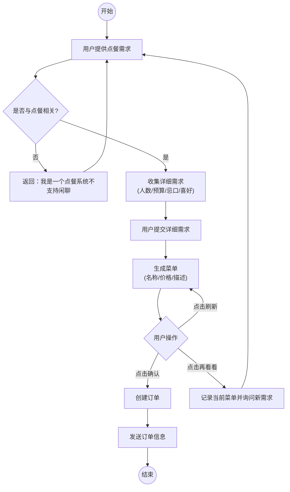

## 点餐的具体流程图，以下是步骤

1. 需要用户提供点餐的需求
2. 如果输入跟点餐无关的，返回 “我是一个点餐系统不支持闲聊”
3. 如果跟点餐相关，需要用户提供点餐的需求，比如多少人预算多少，忌口，喜好
4. 用户发送需求以后，根据描述生成菜单，展示菜品名称，价格，描述
5. 如果用户点击确认，创建订单
6. 如果用户点击再看看，则询问用户还有什么需求，然后返回第一步重新开始，并记录刚才生成的菜单
7. 用户还可以点击刷新，会重新推荐一批
8. 创建订单成功以后给用户发送订单信息

